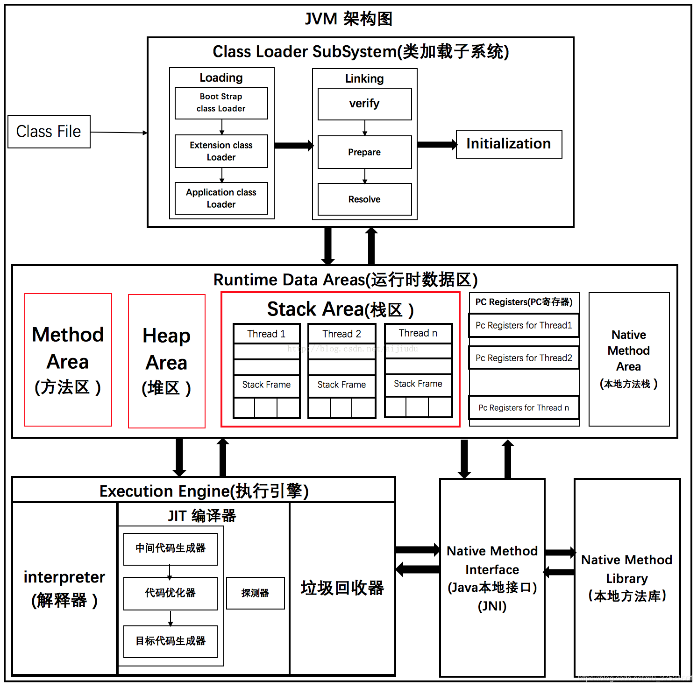
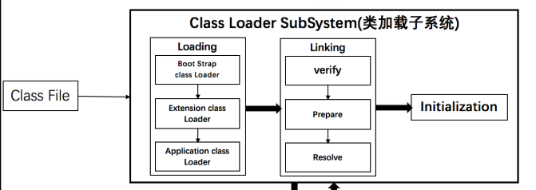
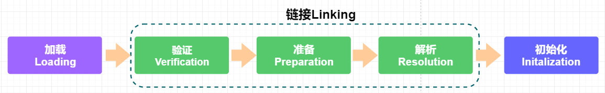
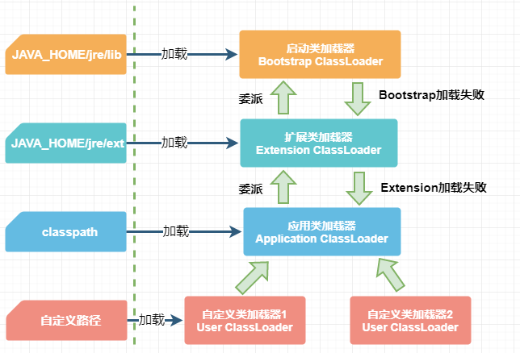
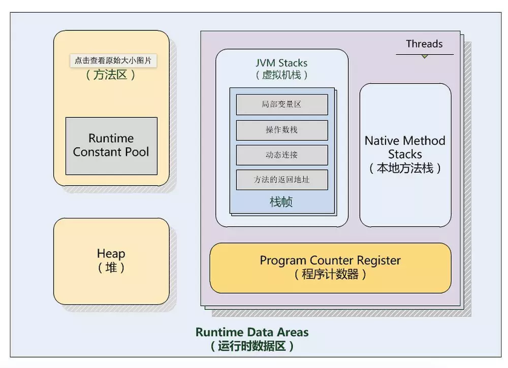
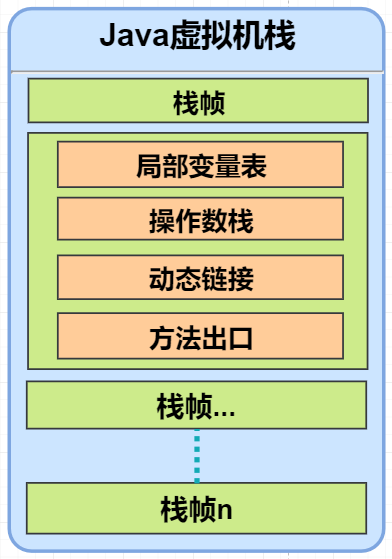
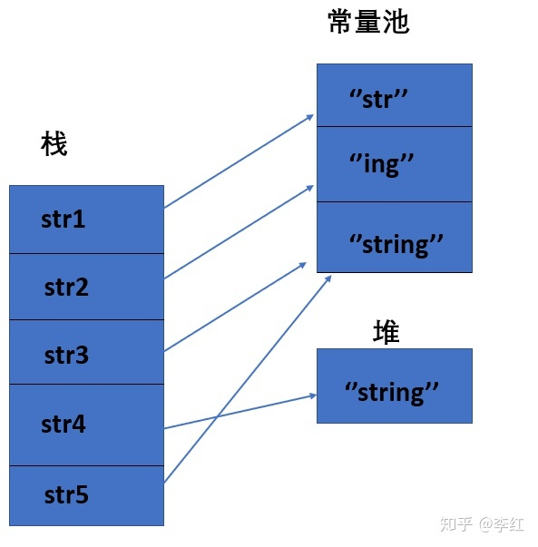
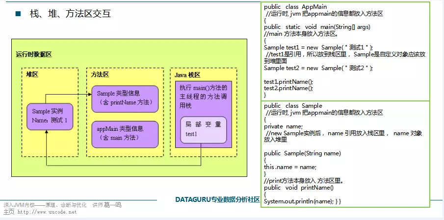

# jvm框架图




从框架上图看，JVM框架主要分为三个子系统：

- **Class Loader SubSystem（类加载子系统**）：加载编译后的.class文件，载入到jvm中，然后进行初始化的操作，把相关数据放到内存中的某些区。
- **Runtime Data Areas（运行时数据区）**：
- **Execution Engine（执行引擎）**：


# 类加载子系统

> 推荐阅读 [我是一个Java class](https://mp.weixin.qq.com/s?__biz=MzAxOTc0NzExNg==&mid=416976590&idx=1&sn=22823ada76d8cfd26a43e8d3a7b7a60e)，文章很形象生动的介绍了类加载的基本过程，有助于加深印象。
>
> https://www.jianshu.com/p/3ca14ec823d7

类加载器（Class Loader） 用来加载java类到jvm中。平常我们写的java源文件（.java文件）经过编译器编译后转换成Java字节码文件（.class文件），类加载器通过类的包名和类名读取.class文件，加载到jvm中。过程：Java代码——>字节码文件——>JVM

JVM将指定的class文件读取到内存里，并运行该class文件里的Java程序的过程，就称之为**类的加载**；反之，将某个class文件的运行时数据从JVM中移除的过程，就称之为**类的卸载**。



jvm将类加载过程大概分为三个步骤：装载（Loading）、链接（Linking）和初始化（Initialization）。



## 类加载过程

### 装载（Loading）

装载过程负责找到二进制字节码并加载到jvm中，类加载器（Class Loader）通过类所在的包名、类名来加载类。

#### 四种类加载器

- **Bootstrap ClassLoader（启动类加载器）**

  负责加载JDK的核心类库。用C++编写的，主要负责加载`JAVA_HOME/jre/lib `目录下的类库，如rt.jar、resources.jar、charsets.jar等。该加载器无法被应用程序使用，它是由JVM调用的。

- **Extension ClassLoader（扩展类加载器）**

  使用Java编写的，父类是BootstrapClassLoader，主要负责加载JRE扩展目录，默认加载`JAVA_HOME/jre/lib/ext` 目录下的所有jar包；

- **Application ClassLoader（应用类加载器）**

  又称系统类加载器（System ClassLoader），使用Java编写的，父类是Extension ClassLoader，主要负责加载`Casspath`下的类，默认情况下，都是使用AppClassLoader来加载开发项目中的类的。

- **用户自定义的类加载器**，继承java.lang.ClassLoader类的方式实现自己的类加载器。

#### 双亲委派模型

> **双亲委派模型（Parents Delegation model）**要求：除了顶层的启动类加载器（BootStrap ClassLoader）外，其余的类加载器都应当有自己的父类加载器。
>
> [【Java】JVM - 双亲委派模型（Parents Delegation model）](https://swsmile.info/2019/03/07/%E3%80%90Java%E3%80%91%E7%B1%BB%E5%8A%A0%E8%BD%BD-%E5%8F%8C%E4%BA%B2%E5%A7%94%E6%B4%BE%E6%A8%A1%E5%9E%8B/)
>
> [JVM类加载器是否可以加载自定义的String](https://zhuanlan.zhihu.com/p/109759851)

**注意**：这里类加载器之间的父子关系不是以**继承**（inheritance）的关系来实现的，而是当加载一个 Class 类时，不同的类加载器在执行这个加载任务时，拥有不同的**优先级**（priority），其中**父类加载器的优先级更高**。**子类加载器总是先委派任务给自己的父类加载器（去执行类加载任务），而不是自己直接执行**。

##### 工作过程

一个类加载器收到了类加载的请求，其工作过程：

1. 当前类加载器首先从自己已经加载的类（缓存）中，查询是否此类已经加载，如果已经加载，则直接返回原来已经加载的类。
2. 如果在当前类加载器的缓存中没有找到期待被加载的类时，则委托父类加载器去加载。父类加载器采用同样的策略，首先查看自己的缓存，（如果仍然没有）则继续委托其父类加载去加载，一直到 BootStrapClassLoader（启动类加载器）。
3. 当所有的父类加载器都没有加载此类时，才由当前的类加载器加载，并将其放入自己的缓存中。



##### 优点

1. 避免类的重复加载。

   Java 类随着它的类加载器一起，具备了一种带有优先级的层次关系，通过这种层级关可以**避免类的重复加载**。

2. 安全因素

   保护Java 核心 API 中定义类不能被修改。不同优先级的类加载器加载加载不同的类，如java.long.String、 java.lang.Integer 等核心类，通过双亲委托模式传递到启动类加载器并返回，避免了核心类被篡改和自定义。

### 链接（Linking）

> [【深入Java虚拟机】之四：类加载机制](https://blog.csdn.net/ns_code/article/details/17881581)

链接分三步：验证（Verification）、准备（Preparation）和解析（Resolution）。

#### 验证（Verification）

验证的目的是为了确保Class文件中的字节流包含的信息符合当前虚拟机的要求，而且不会危害虚拟机自身的安全。

- **文件格式的验证**：验证字节流是否符合Class文件格式的规范，并且能被当前版本的虚拟机处理。**经过该阶段的验证后，字节流才会进入内存的方法区中进行存储**，后面的三个验证都是基于方法区的存储结构进行的。
- **元数据验证**：对类的元数据信息进行语义校验，保证不存在不符合Java语法规范的元数据信息。
- **字节码验证**：该阶段的验证主要是进行数据流和控制流分析，队列的方法体进行校验分析，以保证被校验的类的方法在运行时不会做出危害虚拟机安全的行为。
- **符号引用验证**：这是最后一个阶段的验证，它发生在虚拟机将符号引用转化为直接引用的时候，主要是对类自身以外的信息（常量池中的各种符号引用）进行匹配性的校验。

#### 准备（Preparation）

准备阶段是正式为类变量分配内存并设置类变量初始值的阶段，这些内存都将在方法区中分配。对于该阶段有以下几点需要注意：

1. 这时候进行内存分配的仅包括类变量（static），而不包括实例变量，实例变量会在对象实例化时随着对象一块分配在Java堆中。

2. 这里所设置的初始值通常情况下是数据类型默认的零值（如0、0L、null、false等），而不是被在Java代码中被显式地赋予的值。假设一个类变量的定义为：`public static int value = 3；`

   那么变量value在准备阶段过后的初始值为0，而不是3，因为这时候尚未开始执行任何Java方法，而把value赋值为3的putstatic指令是在程序编译后，存放于类构造器<clinit>（）方法之中的，所以把value赋值为3的动作将在初始化阶段才会执行。

#### 解析（Resolution）

 解析阶段是虚拟机将常量池中的符号引用转化为直接引用的过程。

- 类或接口的解析
- 字段解析
- 类方法解析
- 接口方法解析

### 初始化（Initialization）

 初始化是类加载过程的最后一步，到了此阶段，才真正开始执行类中定义的Java程序代码。在准备阶段，类变量已经被赋过一次系统要求的初始值，而在初始化阶段，则是根据程序员通过程序指定的主观计划去初始化类变量和其他资源，或者可以从另一个角度来表达：初始化阶段是执行类构造器<clinit>()方法的过程。


# 运行时数据区

> 运行时数据区（Runtime Data Areas）。Java虚拟机在执行Java程序的过程中会把它所管理的内存划分为若干个不同的数据区域。这些区域都有各自的用途，以及创建和销毁的时间，有的区域随着虚拟机进程的启动而存在，有些区域则依赖用户线程启动和结束和简历和销毁。



## 程序计数器

> 程序计数（Program Counter Register），就是记录当前线程执行程序的位置，字节码解释器工作时就是通过改变计数器的值来确定执行的下一条指令，比如循环、分支、方法跳转、异常处理、线程恢复等基础功能都是依赖程序计数器来完成。

程序计数器是线程私有的，每条线程都有自己的程序计数器。

由于Java虚拟机的多线程是通过线程轮流切换并分配处理器执行时间的方式来实现的，在任何一个确定的时刻，一个处理器（对于多核处理器来说就是一个内核）都只会执行一条线程中的指令。因此，**为了线程切换后能够恢复到正确的执行位置**，每条线程都需要有一个独立的程序计数器。

## Java虚拟机栈

> Java虚拟机栈（Java Virtual Machine Stacks）是线程私有的，它的生命周期与线程相同。虚拟机栈描述的是Java方法执行的内存模型。
>
> [JVM运行时数据区域介绍](https://cxis.me/2017/05/20/JVM%E8%BF%90%E8%A1%8C%E6%97%B6%E6%95%B0%E6%8D%AE%E5%8C%BA%E5%9F%9F%E4%BB%8B%E7%BB%8D/)

**栈帧**：

每个Java方法在执行的同时都会创建一个栈帧（Statcks Frame）用于存储局部变量、操作数栈、动态链接、方法进出口等信息。**每个方法从调用到执行完成的过程，就对应着一个栈帧在虚拟机中入栈到出栈的过程**。



- **局部变量表**：用来完成方法调用时的参数传递。当方法被调用时，参数会传递到从0开始的连续局部变量表位置上。当实例方法被调用时，第0个局部变量存储的是this。

- **操作数栈**：是一个LIFO的栈，长度由编译期确定，也是存储在方法的Code属性中提供给栈帧使用。

- **动态链接**：栈帧内部包含一个指向运行时常量池的引用，这个引用用来支持当前方法的代码实现动态链接。

  Class文件中，一个方法调用其他方法或者访问其成员变量是通过符号引用来表示的，动态链接作用就是将符号引用转换为实际的直接引用。

**栈异常**：

在Java虚拟机规范中，规定JVM栈有两种异常：

- 当线程申请请求的栈深度大于虚拟机所允许的栈深度，将抛出StackOverflowError异常；
- 如果虚拟机栈可动态扩展，申请不到足够的内存去完成扩展，或者建立新线程时没有足够的内存去创建虚拟机栈，会抛出OutOfMemoryError异常。

## 本地方法栈

本地方法栈（Native Method Stacks）与虚拟机方法栈类似，本地方法栈则是为了Native方法服务。 也会抛出StackOverflowError和OutOfMemoryError异常。

## Java堆（Heap）

对大多数应用来说，Java堆（Heap）是Java虚拟机所管理的内存中最大的一块，Java堆是被所有线程共享的一块内存区域，在虚拟机启动时创建。该内存区域唯一的目的就是**存放对象实例**，**Java对象实例以及数组都在堆上分配**。

Java堆是垃圾收集器管理的主要区域，因此Java堆也常被称为“GC堆”，由于现在收集器基于分代收集算法，Java堆还可以细分为：新生代和老年代。

根据Java虚拟机规范的规定，Java堆可以处于物理上不连续的内存空间中，只要逻辑上是连续的即可，就像我们的磁盘空间一样（或者说，像链表一样虽然内存上不一定连续，但逻辑上是连续）。如果在堆中没有内存完成实例分配，而且堆也没办法再扩展时，将会抛出OutOfMemoryError异常。

## 方法区

方法区（Method Areas），又称Non-Heap（非堆），是各个线程共享的内存区域，用于**存储已被虚拟机加载的类信息、常量、静态变量、即时编译器编译后的代码等数据**（比如spring 使用IOC或者AOP创建bean时，或者使用cglib，反射的形式动态生成class信息等）。

### 运行时常量池

**运行时常量池是方法区的一部分**，Class文件中除了有关类的版本、字段、方法、接口等描述信息外，还有一项**信息是常量池**，用于存放编译期生成的各种字面量和符号引用，这部分内容将在类加载后进入方法区的运行时常量池中存放。

**String类和常量池**

```java
String str1 = "str";
String str2 = "ing";
		  
String str3 = "str" + "ing";		//常量池中的对象
String str4 = str1 + str2;   		//在堆上创建的新的对象	  
String str5 = "string";				//常量池中的对象
System.out.println(str3 == str4);	//false
System.out.println(str3 == str5);	//true
System.out.println(str4 == str5);	//false
```



String.intern() 是一个 Native 方法，它的作用是： 如果运行时常量池中已经包含一个等于此 String 对象内容的字符串，则**返回常量池中该字符串的引用**； 如果没有，则**在常量池中创建与此 String 内容相同的字符串，并返回常量池中创建的字符串的引用**。

```java
String s1 = new String("计算机");
String s2 = s1.intern();
String s3 = "计算机";
System.out.println(s2);			//计算机
System.out.println(s1 == s2);	//false，因为一个是堆内存中的String对象一个是常量池中的String对象
System.out.println(s2 == s3);	//true，因为两个都是常量池中的String对象
```


## 01总结

粗略描述一个类的堆、栈、方法区交互：




# 资料来源

非原创文章，只是资料搬运工，按照自己的理解拼凑知识，感谢大佬们的知识点。

- 《实战JAVA虚拟机》

- 《深入理解java虚拟机》

- [JVM虚拟机-类加载器子系统](https://www.cnblogs.com/canacezhang/p/9237953.html)

- [我是一个Java class](https://blog.csdn.net/xybelieve1990/article/details/53102054)

- [【深入Java虚拟机】之四：类加载机制](https://blog.csdn.net/ns_code/article/details/17881581)

- [深入JVM 原理（一）Java内存模型](https://blog.csdn.net/qq_34707744/article/details/79278169)

- [JVM运行时数据区域](https://zhuanlan.zhihu.com/p/65084302)

- [史上最详细JVM，Java内存区域讲解](https://zhuanlan.zhihu.com/p/82011614)

  