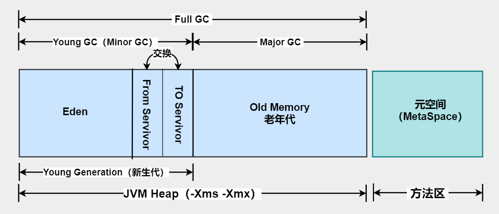
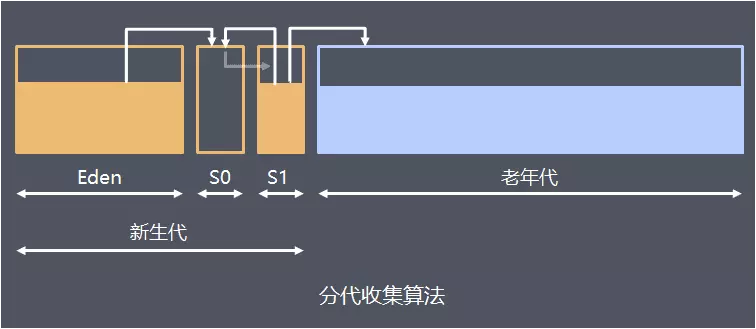
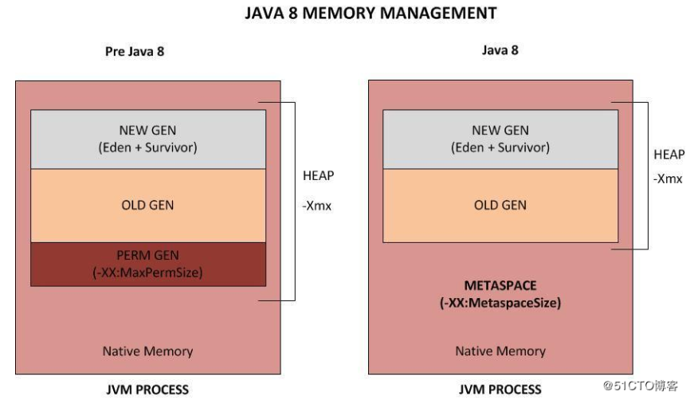

# 堆内存模型
> 对于大多数应用而言，**Java堆（Heap）**是Java虚拟机所管理的内存中最大的一块，它**被所有线程共享的**，在虚拟机启动时创建。此内存区域**唯一的目的**是**存放对象实例**，几乎所有的对象实例都在这里分配内存，且每次分配的空间是**不定长**的。Java虚拟机规范中描述道：所有的对象实例以及数组都要在堆上分配，但是随着JIT编译器的发展和逃逸分析技术逐渐成熟，栈上分配、标量替换优化技术将会导致一些微妙的变化发生，所有的对象都在堆上分配的定论也并不**“绝对”**了。

## 新生代

**新生代（Young Generation）**：新生成的对象优先存放在新生代中，新生代对象一般生命周期短，存活率很低，GC回收频率高。新生代又细分为1个**Eden区**和2个**Survivor区**（**From Servivor**区和**To Servivor区**），默认比例是 8:1:1。

- Eden Space（伊甸园）
- Survivor Space（幸存区）

**大部分对象在Eden区（伊甸园）中生成**。当Eden区满时，还存活的对象将被复制到Survivor区（两个中的一个）。当这个Survivor区满时，此区的存活且不满足晋升到老年代条件的对象将被复制到另外一个Survivor区（对象每经历一次复制，年龄加1，达到晋升年龄阈值后，转移到老年代）。当另一个Survivor区也满了的时候，从前一个Survivor区复制过来的并且此时还存活的对象，将可能被复制到年老代。

2个Survivor区是对称的，没有先后关系，所以同一个Survivor区中可能同时存在从Eden区复制过来对象，和从另一个Survivor区复制过来的对象；而复制到年老区的只有从另一个Survivor区过来的对象。而且，因为需要交换的原因，**Survivor区至少有一个是空的**。特殊的情况下，根据程序需要，Survivor区是可以配置为多个的（多于2个），这样可以增加对象在年轻代中的存在时间，减少被放到年老代的可能。

## 老年代（Old Generation）

新生代中经历了多次（具体次数看配置的阈值）GC后仍然存活的对象将被移入老年代中。老年代中的对象生命周期长，分配空间大，回收频率低，GC消耗时间长。

当年老代空间不够时，JVM会在年老代进行完全的垃圾回收（Full GC）。Full GC后，若Survivor区及年老代仍然无法存放从Eden区复制过来的对象，则会导致JVM无法在Eden区为新生成的对象申请内存，即出现“Out of Memory”。

**OOM（“Out of Memory”）**异常一般主要有如下2种原因：

1. 年老代溢出，表现为：**java.lang.OutOfMemoryError:Javaheapspace**
   这是最常见的情况，产生的原因可能是：设置的内存参数Xmx过小或程序的内存泄露及使用不当问题。
   例如循环上万次的字符串处理、创建上千万个对象、在一段代码内申请上百M甚至上G的内存。还有的时候虽然不会报内存溢出，却会使系统不间断的垃圾回收，也无法处理其它请求。这种情况下除了检查程序、打印堆内存等方法排查，还可以借助一些内存分析工具，比如MAT就很不错。

2. jdk1.8前，存在持久代溢出，表现为：**java.lang.OutOfMemoryError:PermGenspace**
   通常由于持久代设置过小，动态加载了大量Java类而导致溢出 ，解决办法唯有将参数 -XX:MaxPermSize 调大（一般256m能满足绝大多数应用程序需求）。将部分Java类放到容器共享区（例如Tomcat share lib）去加载的办法也是一个思路，但前提是容器里部署了多个应用，且这些应用有大量的共享类库

## 元空间（MetaSpace）

- 元空间存储**类信息、常量、静态变量、即时编译器编译后的代码等数据**，功能和永久代类似。在Java8之后将最初的永久代内存空间取消了，方法区存在于元空间(Metaspace)。

***新生代和老年代组成了Java堆的全部内存区域，元空间不再与堆连续，而且是存在于本地内存（Native memory）即物理内存，直接受到物理内存的限制。***

**JDK 1.8以前的永久代（PermGen）**

JDK 1.8之前的版本，HotSpot虚拟机设计团队选择把GC分代收集扩展至方法区，即用永久代来实现方法区。这样HotSpot的垃圾收集器可以像管理Java堆一样管理这部分内存，能够省去专门为方法区编写内存管理代码的工作。

如果运行时有大量的类产生，可能会导致方法区被填满，直至溢出，报出`java.lang.OutOfMemoryError: PermGen space`。

**JDK 1.8的元空间（Metaspace）**

在JDK 1.8中，移除了永久代，选择使用**本地化的内存空间**（而不是JVM的内存空间）存放类的元数据，这个空间叫做**元空间（Metaspace）**。

做了这个改动以后，`java.lang.OutOfMemoryError: PermGen`的空间问题将不复存在，`-XX:+PermSize`和 `-XX:+MaxPermSize`也已经无效。元数据的空间配置参数：` -XX:MaxMetaspaceSize`。

## 内存申请&GC

当一组对象生成时，内存申请大概过程如下：

JVM会试图为相关Java对象在年轻代的Eden区中初始化一块内存区域。

- 当Eden区空间足够时，内存申请结束。否则执行下一步。

- 若Eden区空间不足时，JVM试图释放在Eden区中所有不活跃的对象（Young GC）。释放后若Eden空间仍然不足以放入新对象，JVM则试图将部分Eden区中活跃对象放入Survivor区。

- Survivor区被用来作为Eden区及年老代的中间交换区域。当年老代空间足够时，Survivor区中存活了一定次数的对象会被移到年老代。

- 当年老代空间不够时，JVM会在年老代进行完全的垃圾回收（Full GC）。Full GC后，若Survivor区及年老代仍然无法存放从Eden区复制过来的对象，则会导致JVM无法在Eden区为新生成的对象申请内存，即出现“Out of Memory”。

# 资料

- [面试官，Java8中JVM内存结构变了，永久代到元空间](https://blog.51cto.com/14230003/2447159)

- [史上最详细JVM，Java内存区域讲解](https://zhuanlan.zhihu.com/p/82011614)

- [深入JVM 原理（三）JVM 垃圾收集](https://blog.csdn.net/qq_34707744/article/details/79281249)

- [深入JVM 原理（七）老年代、永久代和元空间](https://blog.csdn.net/qq_34707744/article/details/79288787)