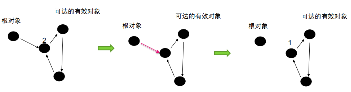
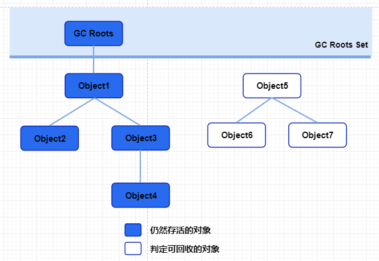
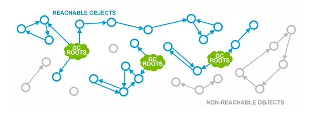
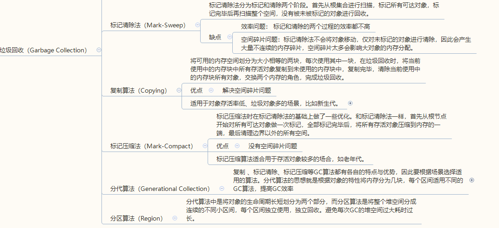
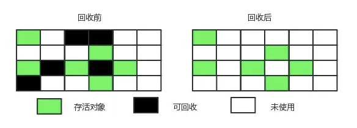
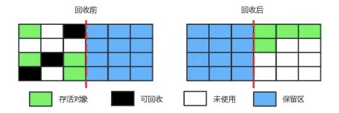
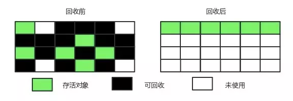
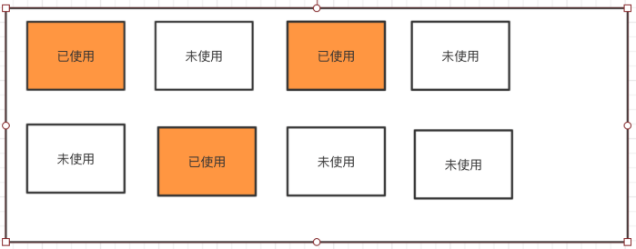

> 垃圾收集，Garbage Collection，简称GC 。这里所谓的垃圾指的是**在系统运行过程当中所产生的一些无用的对象，这些对象占据着一定的内存空间，如果长期不被释放，可能导致OOM**。
>
> GC时，系统会进入停顿状态，终止所有应用线程的执行，避免新的垃圾的生成，同时保持系统的一致性。这个停顿称为**“Stop-The-Wold”**，**“STW“**
>
> 文章主要摘抄自《深入理解 Java 虚拟机》
>
> 推荐阅读[【JVM】JVM进阶之JVM算法及种类](https://blog.csdn.net/gaoying_blogs/article/details/77748211)

Java虚拟机在执行Java程序的过程中会把它所管理的内存划分为若干个不同的数据区域（运行时数据区，Runtime Data Area）。这些区域都有各自的用途，以及创建和销毁的时间。

对于程序计数器、Java虚拟机栈和本地方法栈来说，它们都是现成私有的，生命周期和当前线程一致，当线程销毁时其占有的内存自然回收。

而Java堆和方法区是被所有线程共享的内存区域，一个接口的多个实现类需要的内存可能不一样，一个方法中多个分支所占内存也可能不一样。这部分的内存的分配和回收都是动态的。

**GC 需要考虑的三件事情：**

- 那些内存需要回收？
- 什么时候回收？
- 如何回收？

# 判断对象是否存活

## 引用计数法

> 给对象中添加一个引用计数器，每当有一个地方引用它时，计数器值就加1；当引用失效时，计数器值就减1；任何时刻计数器为0的对象就是不可能再被使用的。

引用计数算法是垃圾收集器中的早期策略。在这种方法中，堆中的每个对象实例都有一个引用计数。当一个对象被创建时，且将该对象实例分配给一个引用变量，该对象实例的引用计数设置为 1。当任何其它变量被赋值为这个对象的引用时，对象实例的引用计数加 1（a = b，则b引用的对象实例的计数器加 1），但当一个对象实例的某个引用超过了生命周期或者被设置为一个新值时，对象实例的引用计数减 1。特别地，当一个对象实例被垃圾收集时，它引用的任何对象实例的引用计数器均减 1。任何引用计数为0的对象实例可以被当作垃圾收集。

**缺点：**

- 引用和去引用伴随加法和减法，影响性能；
- 致命的缺陷：**无法处理循环引用问题**。



最右边的那张图而言：循环引用的计数器都不为0，但是他们对于根对象都已经不可达了，但是无法释放。

主流的java虚拟机并没有选用引用计数算法来管理内存，其中最主要的原因是：**无法处理循环引用问题**。

## 可达性分析法

> 可达性分析算法是通过判断对象的引用链是否可达来决定对象是否可以被回收。

这个算法的基本思路就是通过一系列的成为**“GC Roots”**的对象作为起始点，从这些根节点开始向下搜索它们引用的对象，搜索过程所走过的路径称为**“引用链（Reference Chain）”**，最终可以生成一颗引用树，**树的节点视为可达对象，反之视为不可达**。





在 Java 语言中，可作为 GC Roots 的对象包括以下几种：

- 虚拟机栈（栈中的本地变量表）中的引用对象；
- 方法区中的类静态属性引用的对象；
- 方法区中的常量引用的对象；
- 本地方法栈总JNI（Native方法）引用的对象。

### 四种引用

如论是通过引用计数算法还是可达性分析算法去判断对象是否存活，都与“引用”有关。引用分为：**强引用（Strong Reference）、软引用（Soft Reference）、弱引用（Weak Reference）以及虚引用（Phanton Reference）**，引用强度依次减弱。

#### 强引用

**强引用**就是指在程序代码之中普遍存在的，类似"Object obj = new Object()"这类的引用，**只要强引用还存在，垃圾收集器永远不会回收掉被引用的对象**。

```java
Object obj = new Object();
```

#### 软引用

**软引用**是用来描述一些还有用但并非必需的对象，**对于软引用关联着的对象，在系统将要发生内存溢出异常之前，将会把这些对象列进回收范围进行第二次回收。如果这次回收还没有足够的内存，才会抛出内存溢出异常**。在JDK1.2之后，提供了SoftReference类来实现软引用。

```java
Object obj = new Object();
SoftReference<Object> sf = new SoftReference<Object>(obj);
```

#### 弱引用

**弱引用**也是用来描述非必需对象的，但是它的强度比软引用更弱一些，被弱引用关联的对象，只能生存到下一次垃圾收集发生之前。**当垃圾收集器工作时，无论当前内存是否足够，都会回收掉只被弱引用关联的对象**。在JDK1.2之后，提供了WeakReference类来实现弱引用。

```java
Object obj = new Object();
WeakReference<Object> wf = new WeakReference<Object>(obj);
```

#### 虚引用

**虚引用**也成为幽灵引用或者幻影引用，它是最弱的一中引用关系。一个对象是否有虚引用的存在，完全不会对其生存时间构成影响，也无法通过虚引用来取得一个对象实例。**为一个对象设置虚引用关联的唯一目的就是能在这个对象被收集器回收时收到一个系统通知**。在JDK1.2之后，提供给了PhantomReference类来实现虚引用。

```java
Object obj = new Object();
PhantomReference<Object> pf = new PhantomReference<Object>(obj);
```


# 垃圾回收算法

GC时，系统会进入停顿状态，终止所有应用线程的执行，避免新的垃圾的生成，同时保持系统的一致性。这个停顿称为**“Stop-The-Wold”**。GC优化很多时候就是指减少Stop-the-world发生的时间，从而使系统具有高吞吐 、低停顿的特点。

常见的垃圾回收算法有：**标记-清除算法（Mark-Sweep）、复制算法（Copying）、标记整理算法（Mark-Compact）、分代收集算法（Generational Collecting）**。



## 标记-清除算法（Mark-Sweep）

最基础的收集算法是“标记-清除”算法（Mark-Sweep）。顾名思义，算法分为 “标记” 和 “清除” 两个阶段：**首先标记出所有需要回收的对象，在标记完成后统一回收所有被标记的对象。**

- **标记阶段**：标记的过程其实就是前面介绍的可达性分析算法的过程，遍历所有的GC Roots对象，对从GC Roots对象可达的对象都打上一个标识，一般是在对象的header中，将其记录为可达对象；

- **清除阶段**：清除的过程是对堆内存进行遍历，如果发现某个对象没有被标记为可达对象（通过读取对象header信息），则将其回收。

之所以说它是最基础的收集算法，是因为后续的收集算法都是基于这种思路，并对其不足进行改进而得到。

**缺点：**

- **效率问题**：标记和清除两个过程的效率都不高；
- **空间问题**：会产生大量不连续的内存碎片，内存碎片过多可能导致无法给大对象分配内存。



## 复制算法（Copying）

将可用的内存空间划分为大小相等的两块，每次使用其中一块，在垃圾回收时，将当前使用中的内存块中所有存活对象复制到未使用的内存块中，复制完毕，清除当前使用中的内存块所有对象，交换两个内存的角色，完成垃圾回收。

jvm堆中新生代区基本采用这种收集算法，但是并不是将内存划分为大小相等的两块，而是分为一块较大的 Eden 空间和两块较小的 Survior 空间（默认比例8：1：1）。**每次使用 Eden 空间和其中一块 Survivor。在回收时，将 Eden 和 Survivor 中还存活着的对象一次性复制到另一块 Survivor 空间上，最后清理 Eden 和 使用过的那一块 Survivor。**



**优点**：

- 解决空间碎片问题。

**缺点**：

- 有一半的内存处于空闲状态，浪费资源。

**使用场景**：

**适用于对象存活率低、垃圾对象多的场景，比如新生代**。如果是对象存活率高的场景，如老年代，会造成较多的复制操作，且回收效率低。

## 标记-整理算法（Mark-Compact）

标记压缩法时在标记清除法的基础上做了一些优化，以解决了空间碎片问题。和标记清除法一样，首先从根节点开始对所有可达对象做一次标记，**全部标记完毕后，将所有存活对象压缩到内存的一端，最后清理边界以外的所有空间。**



**优点：**

- **解决空间碎片问题**。解决了标记清理算法的空间碎片问题。
- 解决了复制算法算法中的空闲空间浪费问题。

**缺点：**

- 效率不高，不仅要标记存活对象，还要整理所有存活对象的引用地址，在效率上不如复制算法。

**适用场景：**

- 标记压缩算法适合用于对象存活率高的场合，如老年代。

## 分代收集算法（Generational Collection）

复制 、标记清除、标记压缩等GC算法都有各自的特点与优势，因此要根据场景选择适用的算法。分代算法的思想就是根据对象的特性将内存分为几块，每个区间适用不同的GC算法，提高GC效率。

jvm堆分为两区域：新生代和老年代。

- 新生代（Young Generation）对象存活率低、垃圾对象多、回收率高，适合使用复制算法。
- 老年代（Old Generation）对象存活率高、垃圾对象相对较少，适合使用标记-整理算法。

## 分区算法（Region）

分代是按对象的生命周期划分，分区则是将堆空间划分连续几个不同小区间，每一个小区间独立回收，可以控制一次回收多少个小区间，方便控制 GC 产生的停顿时间。**分区算法仍保留新生代和老年代的概念，只是弱化了分代的概念，合理利用垃圾收集各个周期的资源。**




# 资料来源

- [【JVM】JVM进阶之JVM算法及种类](https://blog.csdn.net/gaoying_blogs/article/details/77748211)
- [JVM GC算法](https://juejin.im/entry/5abc9f616fb9a028c42e4722)
- https://tech.meituan.com/2017/12/29/jvm-optimize.html
- https://juejin.im/post/5b6b986c6fb9a04fd1603f4a
- [【深入浅出-JVM】（24）：垃圾回收——分区算法(Region)](http://mousycoder.com/thinking-in-jvm/24/)

