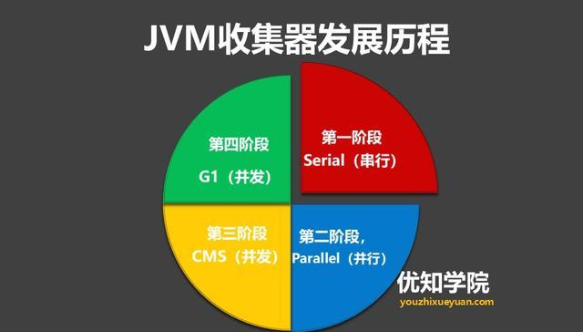
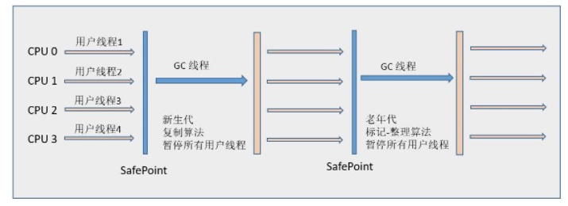
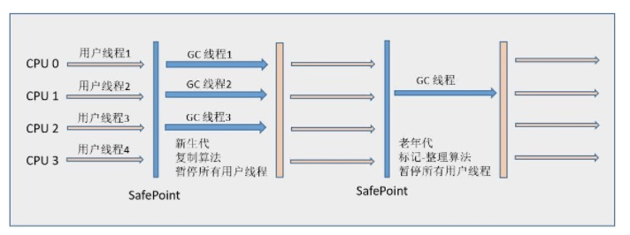
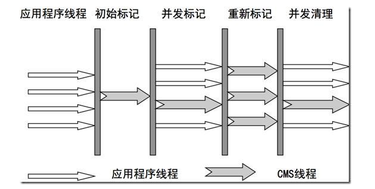
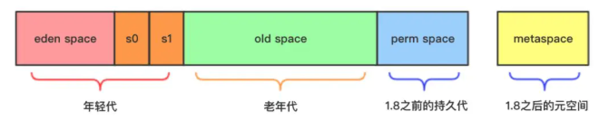
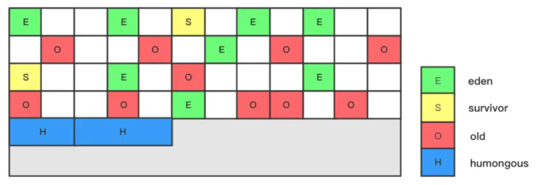
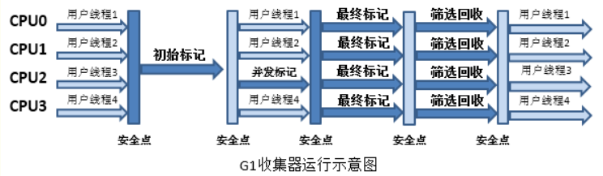
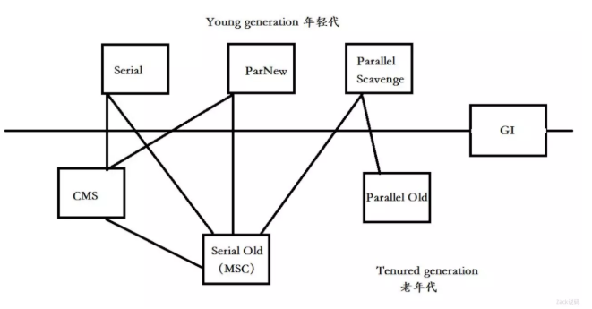

> **如果说收集算法是内存回收的方法论，那么垃圾收集器就是内存回收的具体实现。**Java虚拟机规范中对垃圾收集器应该如何实现并没有任何规定，因此不同的厂商、版本的虚拟机所提供的垃圾收集器都可能会有很大差别，并且一般都会提供参数供用户根据自己的应用特点和要求组合出各个年代所使用的收集器。

垃圾收集器一般主要考虑以下两个性能参数：

- **吞吐量**

  `CPU` 用于运行用户代码的时间与 `CPU` 总消耗时间的比值。比如说虚拟机总运行了 `100` 分钟，**用户代码** 时间 `99` 分钟，**垃圾回收** 时间 `1` 分钟，那么吞吐量就是 `99%`。

  > 吞吐量 = 运行用户代码时间/（运行用户代码时间 + 垃圾回收时间）

- **停顿时间**

  **停顿时间指垃圾回收器正在运行时，应用程序的暂停时间**。对于 **独占回收器** 而言，停顿时间可能会比较长。使用 **并发回收器** 时，由于垃圾回收器和应用程序 **交替运行**，程序的 **停顿时间** 会变短，但是，由于其 **效率** 很可能不如独占垃圾回收器，故系统的 **吞吐量** 可能会较低。

GC 又一般分为新生代和老年代的GC：

- **新生代GC（Minor GC、Young GC）**

  指发生在 **新生代** 的垃圾回收动作，因为 `Java` 对象大多都具备 **朝生夕死** 的特性，所以 `Minor GC` 通常 **非常频繁**，一般回收速度也比较快。

- **老年代GC（Major GC、Full GC）**

  指发生在 **老年代** 的垃圾回收动作，出现了 `Major GC`，经常会伴随至少一次的 `Minor GC`（发生这种情况，那么 **整个堆** 都 `GC` 一遍，通常称为 **Full GC**）。`Major GC` 的速度一般会比 `Minor GC` 慢 `10` 倍以上。

# 垃圾收集器发展历程

## Serial（串行）收集器

**Serial（串行）**收集器是最基本、发展历史最悠久的收集器，它是采用**复制算法**的**新生代收集器**，曾经（JDK 1.3.1之前）是虚拟机**新生代**收集的唯一选择。它是一个单线程收集器，只会使用一个CPU或一条收集线程去完成垃圾收集工作，更重要的是**它在进行垃圾收集时，必须暂停其他所有的工作线程，直至Serial收集器收集结束为止（“Stop The World”）**。

单线程地好处就是减少上下文切换，减少系统资源的开销。但这种方式的缺点也很明显，在GC的过程中，会暂停程序的执行。若GC不是频繁发生，这或许是一个不错的选择，否则将会影响程序的执行性能。

垃圾回收算法：**复制算法（新生代）** 和 **标记整理算法（老年代）**

串行收集器根据新生代和老年代的特点，使用了不同的算法：

- **Serial串行收集器 - 复制算法**：适用新生代。
- **Serial Old 收集器 - 标记整理算法**，是Serial收集器的老年代版本，它同样是一个单线程(串行)收集器，使用标记整理算法。

## Parallel（并行）收集器

Parallel收集器也称吞吐量收集器，相比Serial收集器，Parallel最主要的优势在于使用多线程去完成垃圾清理工作，这样可以充分利用多核的特性，大幅降低gc时间。

并行收集器在**单CPU的环境**中绝对不会有比Serial收集器有更好的效果，甚至由于存在线程交互的开销，该收集器在通过超线程技术实现的两个CPU的环境中都不能百分之百地保证可以超越。在**多CPU环境**下，随着CPU的数量增加，它对于GC时系统资源的有效利用是很有好处的。它默认开启的收集线程数与CPU的数量相同。

垃圾回收算法：**复制算法（新生代）**和  **标记整理算法（老年代）**

有以下类型：

- **ParNew 收集器**：是**新生代并行收集器**，其实就是Serial收集器的多线程版本。（**复制算法**）
- **Parallel Scavenge（并行回收）**：是新生代并行收集器，追求高吞吐量，高效利用 CPU。该收集器的**目标是达到一个可控制的吞吐量（Throughput）**。（**复制算法**）
- **Parallel Old 收集器**：是Parallel Scavenge收集器的老年代版本，但使用的是“**标记-整理**”算法。

## CMS（并发）收集器

CMS，**Concurrent Mark Sweep**。CMS收集器在Minor GC时会暂停所有的应用线程，并以多线程的方式进行垃圾回收。在Full GC时不再暂停应用线程，而是使用若干个后台线程定期的对老年代空间进行扫描，及时回收其中不再使用的对象。**（老年代的GC收集器）**

### 回收算法

垃圾回收算法：**标记清除算法（Mark Sweep）**

### CMS回收流程

CMS整个过程分为四步：

- **初始标记（initial mark）**

  单线程执行，需要“Stop The World”，但仅仅把GC Roots的直接关联可达的对象给标记一下，由于直接关联对象比较小，所以这里的速度非常快。（**STW执行**）

- **并发标记（concurrent mark）**

  对于初始标记过程所标记的初始标记对象，进行并发追踪标记，此时其他线程仍可以继续工作。此处时间较长，但不停顿。

- **重新标记（remark）**

  在并发标记的过程中，由于可能还会产生新的垃圾，所以此时需要重新标记新产生的垃圾。此处执行并行标记，与用户线程不并发，所以依然是“Stop The World”，时间比初始时间要长一点。（**STW执行**）

- **并发清除（concurrent sweep）**

  并发清除之前所标记的垃圾。其他用户线程仍可以工作，不需要停顿。

由于最耗费时间的并发标记与并发清除阶段都不需要暂停工作，所以整体的回收是低停顿的。

### 缺点

由于CMS以上特性，**缺点**也是比较明显的：

- Mark Sweep算法会导致内存碎片比较多；
- CMS的并发能力依赖于CPU资源，所以在CPU数少和CPU资源紧张的情况下，性能较差；
- 并发清除阶段，用户线程依然在运行，所以依然会产生新的垃圾，此阶段的垃圾并不会再本次GC中回收，而放到下次。所以GC不能等待内存耗尽的时候才进行GC，这样的话会导致并发清除的时候，用户线程可以了利用的空间不足。

**为什么不把算法换成Mark Compact呢？**

*因为当并发清除的时候，用Compact整理内存的话，原来的用户线程使用的内存还怎么用呢？要保证用户线程能继续执行，前提的它运行的资源不受影响。Mark Compact更适合“Stop the World”这种场景下使用。*

>
> From: [一文了解JVM全部垃圾回收器，从Serial到ZGC](https://juejin.im/post/5bade237e51d450ea401fd71)

## G1（并发）收集器

G1收集器（或者垃圾优先收集器）的设计初衷是为了尽量缩短处理超大堆（大于4GB）时产生的停顿。相对于CMS的优势而言是内存碎片的产生率大大降低，是一款面向服务端应用的垃圾收集器。

### G1特点

- **并行与并发**：G1能充分利用多CPU、多核环境下的硬件优势，来缩短 "Stop-The-Word" 停顿时间，部分其他收集器原来需要停顿Java线程执行的GC动作，G1仍然可以通过并发的方式让Java程序继续执行。
- **分代收集**：与其他收集器一样，分代概念在G1中依然保留。虽然G1可以不需要其他收集器配合就能独立管理整个GC堆，但它能够采用不同的方式去处理新创建对象和熬过多次GC的旧对象以获取更好的收集效果。
- **空间整合**：与CMS的“标记-清理”算法不同，G1从整体上看是基于“标记-整理”算法实现的收集器，从局部（两个Region之间）上来看是基于“复制”算法实现的，意味着G1不会产生内存空间碎片。
- **可预测的停顿**：G1除了追求低停顿外，还能简历可预测的停顿时间模型，让使用者明确指定在一个长度为M毫秒的时间片内，消耗在垃圾收集上的时间不得超过N毫秒。

### G1堆内存结构

以往的垃圾回收器将堆分为新生代和老年代，新生代和老年代必须是地址**连续的空间**，但新生代和老年代是物理隔离的。

而G1变化较大的是它**将整个Java堆划分为若干相同大小的区域（化整为零），即 region**，包括 Eden、Survivor、 Old、 Humongous 四种类型。虽然还保留了新生代和来年代的概念，但新生代和老年代不再是物理隔离的了它们都是一部分Region（不需要连续）的集合。

这样的分区可以**有效避免内存碎片化问题**。

### Remembered Set

但是这样同样会引申一个新的问题，就是分代的内存不连续，导致在GC搜索垃圾对象的时候需要全盘扫描找出引用内存所在。为了解决这个问题，**G1对于每个Region都维护一个Remembered Set**，用于记录对象引用的情况。当GC发生的时候根据Remembered Set的引用情况去搜索。

### G1回收流程

- **初始标记（initial mark）**，标记了从GC Root开始直接关联可达的对象。（**STW执行**）
- **并发标记（concurrent marking）**，并发标记初始标记的对象，此时用户线程依然可以执行。
- **最终标记（Remark）**，标记再并发标记过程中产生的垃圾。（**STW执行**）
- **筛选回收（Live Data Counting And Evacuation）**，评估标记垃圾，根据GC模式回收垃圾。（**STW执行**）

### 回收算法

整体上使用的是**分区算法**，但在Region层面上，整体的算法偏向于Mark-Compact。因为是Compact，会影响用户线程执行，所以回收阶段需要STW执行。

## ZGC 收集器

Z Garbage Collector 垃圾收回器，也被称为 ZGC, 是一种可伸缩的低延迟垃圾收集器，它的回收耗时平均不到2毫秒。**在JDK 11当中，加入了实验性质的ZGC**。

**目标：**

- 垃圾回收停顿时间不超过10ms
- 无论是相对小的堆(几百MB)还是大堆(TB级)都能应对自如
- 与G1相比，吞吐量下降不超过15%
- 方便日后在此基础上实现新的gc特性、利用colored pointers和读屏障进一步优化收集器

# 使用场景

图中有 `7` 种不同的 **垃圾回收器**，它们分别用于不同分代的垃圾回收。

- **新生代回收器**：Serial、ParNew、Parallel Scavenge
- **老年代回收器**：Serial Old、Parallel Old、CMS
- **整堆回收器**：G1、ZGC（JDK11）

# 常用参数

配置回收器时，经常使用的参数：

| 参数                    | 说明                                           |
| ----------------------- | ---------------------------------------------- |
| -XX:+UseSerialGC        | 在新生代和老年代使用串行收集器                 |
| -XX:+UseParNewGC        | 在新生代使用并行收集器                         |
| -XX:+UseParallelGC      | 新生代使用并行回收收集器，更加关注吞吐量       |
| -XX:+UseParallelOldGC   | 老年代使用并行回收收集器                       |
| -XX:ParallelGCThreads   | 设置用于垃圾回收的线程数                       |
| -XX:+UseConcMarkSweepGC | 新生代使用并行收集器，老年代使用CMS+串行收集器 |
| -XX:ParallelCMSThreads  | 设定CMS的线程数量                              |
| -XX:+UseG1GC            | 启用G1垃圾回收器                               |

# 资料来源

> 非原创的文章，只是资料的搬运工。

- [深入理解JVM(3)——7种垃圾收集器](https://crowhawk.github.io/2017/08/15/jvm_3/)
- [一文看懂 JVM 内存布局及 GC 原理](https://www.infoq.cn/article/3WyReTKqrHIvtw4frmr3)
- [深入剖析JVM：G1收集器+回收流程+推荐用例](https://zhuanlan.zhihu.com/p/59861022)
- [详解 JVM Garbage First(G1) 垃圾收集器](https://blog.csdn.net/coderlius/article/details/79272773)
- [JVM系列(六) - JVM垃圾回收器](https://juejin.im/post/5b651200f265da0fa00a38d7)
- [Java垃圾回收CMS、G1、ZGC](https://www.cnblogs.com/zeussbook/p/12726824.html)
- [一文了解JVM全部垃圾回收器，从Serial到ZGC](https://juejin.im/post/5bade237e51d450ea401fd71)
- [详解 JVM Garbage First(G1) 垃圾收集器](https://blog.csdn.net/coderlius/article/details/79272773)
