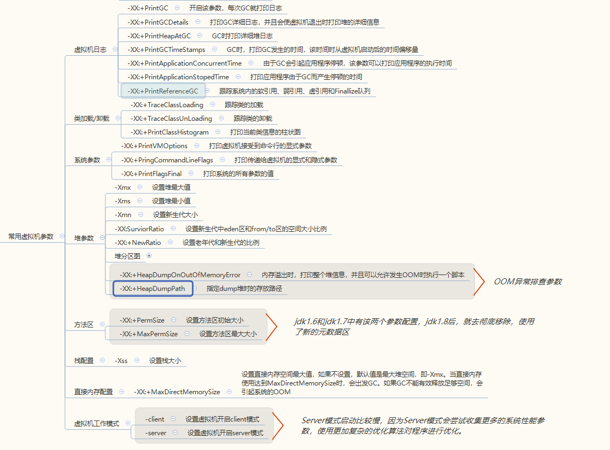

> 在虚拟机的运行过程中，如果可以追踪系统的运行状态，那么对于问题的故障排查会有一定帮助。为此，虚拟机提供了一些跟踪系统状态的参数，使用给定的参数执行Java虚拟机，就可以在系统运行时打印相关日志，用于分析问题。
>
> [Java HotSpot VM Options](https://www.oracle.com/technetwork/articles/java/vmoptions-jsp-140102.html)

# JVM 参数分类

> - Options that begin with `-X` are non-standard (not guaranteed to be supported on all VM implementations), and are subject to change without notice in subsequent releases of the JDK.
> - Options that are specified with `-XX` are not stable and are subject to change without notice.

根据jvm参数开头可以区分参数类型，共三类：“-”、“-X”、“-XX”，

- **标准参数 “-” **：所有的JVM实现都必须实现这些参数的功能，而且向后兼容；

  eg：-verbose:class，-verbose:gc，-verbose:jni…

- **非标准参数 “-X” **：默认jvm实现这些参数的功能，但是并不保证所有jvm实现都满足，且不保证向后兼容；

  eg：Xms20m，-Xmx20m，-Xmn20m，-Xss128k…

- **非Stable参数 “-XX” **：此类参数各个jvm实现会有所不同，将来可能会随时取消，需要慎重使用；

  eg：-XX:+PrintGCDetails，-XX:-UseParallelGC，-XX:+PrintGCTimeStamps…


# JVM 常用参数




## GC日志参数

> 当垃圾回收频繁或者占用太长的CPU时间时，需要一些跟踪参数来进一步甄别垃圾回收器的效率和效果。

| 参数                | 说明                                                         |
| :------------------------- | ------------------------------------------------------------ |
| -XX:+PrintGC        | 打印GC的基本日志                                             |
| -XX:+PrintGCDetails | 打印GC详细日志，并且会使虚拟机退出时打印堆的详细信息，详细描述当前堆的各个区的使用情况 |
| -XX:+PrintHeapAtGC | 在GC日志输出前后，都有详细的堆信息输出，分别表示GC回收前和回收后的堆信息，使用这个参数可以很好观察GC对堆空间的影响。 |
| -XX:+PrintGCTimeStamps | GC时，打印GC发生的时间，该时间时从虚拟机启动后的时间偏移量 |
| -XX:+PrintApplicationConcurrentTime | 该参数可以打印应用程序的执行时间 |
| -XX:+PrintApplicationStopedTime | 打印应用程序由于GC而产生停顿的时间 |
| -XX:+PrintReferenceGC | 跟踪系统内的软引用、弱引用、虚引用和Finallize队列 |
| -Xloggc:<filename> | 输出GC日志到指定文件，-Xloggc:log/gc.log，指定将GC日志输出到“log/gc.log“下 |

## 垃圾回收器参数

| 参数                    | 说明                                           |
| ----------------------- | ---------------------------------------------- |
| -XX:+UseSerialGC        | 在新生代和老年代使用串行收集器                 |
| -XX:+UseParNewGC        | 在新生代使用并行收集器                         |
| -XX:+UseParallelGC      | 新生代使用并行回收收集器，更加关注吞吐量       |
| -XX:+UseParallelOldGC   | 老年代使用并行回收收集器                       |
| -XX:ParallelGCThreads   | 设置用于垃圾回收的线程数                       |
| -XX:+UseConcMarkSweepGC | 新生代使用并行收集器，老年代使用CMS+串行收集器 |
| -XX:ParallelCMSThreads  | 设定CMS的线程数量                              |
| -XX:+UseG1GC            | 启用G1垃圾回收器                               |

## 类加载/卸载参数

> Java程序运行离不开类的加载，为了更好地理解程序的执行，有时候需要知道系统加载了哪些类。一般情况下，系统加载的类存在于文件系统中，以jar的形式打包或者以class文件的形式存在。但是随着动态代理、AOP等技术的普遍使用，系统也机油可能在运行时动态生成某些类，这些类相对比较隐蔽，无法通过文件系统找到，为此，虚拟机提供的类加载/卸载跟踪参数就显得格外有意义。

| 参数                     | 说明                   |
| ------------------------ | ---------------------- |
| -verbose:class           | 跟踪类的加载和卸载     |
| -XX:+TraceClassLoading   | 跟踪类的加载           |
| -XX:+TraceClassUnloading | 跟踪类的卸载           |
| -XX:+PrintClassHistogram | 打印当前的类信息柱状图 |

## 堆参数

| 参数                            | 说明                                                         |
| ------------------------------- | ------------------------------------------------------------ |
| -Xms                            | 设置堆最小值                                                 |
| -Xmx                            | 设置堆最大值                                                 |
| -Xmn                            | 设置新生代大小                                               |
| -XX:SurvivorRatio               | 设置新生代中eden空间和from/to空间的比例关系                  |
| -XX:NewRatio                    | 设置老年代和新生代的空间比例，`-XX:NewRatio=老年代/新生代`   |
| -XX:+HeapDumpOnOutOfMemoryError | 内存溢出时，打印整个堆信息，并且可以允许发生OOM时执行一个脚本 |
| -XX:+HeapDumpPath               | 指定dump堆时的存放路径                                       |

经常比较容易混淆的参数：

- -Xms ：-X ，memory，size
- -Xmx：-X，memory，max
- -Xmn：-X，memory，new
- -Xss：-X，stack，size

## 栈参数

| 参数 | 说明             |
| ---- | ---------------- |
| -Xss | 指定线程的栈大小 |

## 方法区参数

> 在JDK 1.8中，移除了永久代，选择使用**本地化的内存空间**（而不是JVM的内存空间）存放类的元数据，这个空间叫做**元空间（Metaspace）**。

| 参数                 | 说明                                       |
| -------------------- | ------------------------------------------ |
| -XX:+PermSize        | 设置方法区初始大小（JDK1.6 和 JDK1.7版本） |
| -XX:+MaxPermSize     | 设置方法区最大大小（JDK1.6 和 JDK1.7版本） |
| -XX:MaxMetaspaceSize | 设置元空间大小（JDK1.8+）                  |

## 直接内存配置

> 直接内存也是Java程序中非常重要的组成部分，特别是在NIO被广泛使用后，直接内存的使用也变得非常普遍。直接内存跳过了JAVA堆，使JAVA程序可以直接访问原生堆空间，因此，某种程度上加快了内存空间的访问速度。

| 参数                     | 说明                                                         |
| ------------------------ | ------------------------------------------------------------ |
| -XX:+MaxDirectMemorySize | 设置直接内存空间最大值，如果不设置，默认值是最大堆空间，即-Xmx。当直接内存使用达到MaxDirectMemorySize时，会出发GC。如果GC不能有效释放足够空间，会引起系统的OOM |

## 虚拟机工作模式

> 目前 JAVA 虚拟机支持Client和Server两种运行模式。默认情况下，虚拟机会根据当前计算机系统环境自动选择运行模式。

使用`-version`参数可以查看当前虚拟机的模式。

```
>java -version
java version "1.8.0_144"
Java(TM) SE Runtime Environment (build 1.8.0_144-b01)
Java HotSpot(TM) 64-Bit Server VM (build 25.144-b01, mixed mode)
```

**Server模式启动比较慢，因为Server模式会尝试收集更多的系统性能参数，使用更加复杂的优化算法对程序进行优化。但是当系统完全启动并进入运行稳定期后，Server模式的执行速度会远远快于Client模式**。但是对于用户界面程序，运行时间不长，又追求启动速度，Client模式也不错的选择。

| 参数    | 说明                     |
| ------- | ------------------------ |
| -server | 设置虚拟机开启server模式 |
| -client | 设置虚拟机开启client模式 |


# 资料

- 《实战JAVA虚拟机》
- https://www.iteye.com/blog/leichenlei-2097797