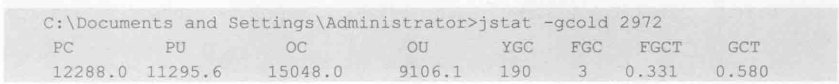

> 在JDK的开发中，除了大家熟悉的 java.exe 和 javac.exe 外，还有一些列辅助工具。这些辅助工具可以帮助开发人员很好的解决 Java 应用程序的一些疑难杂症。这些工具在 JDK 安装目录下的 bin 目录中。


## JDK 性能工具


## 查看 Java进程 - jps 命令

> jps命令类似与linux下的ps命令。jps 命令可以列出所有的 Java 进程。通过jps命令可以查看java进程id、启动类、传入参数以及jvm参数。

**常用参数**：

| 参数 | 说明                     |
| ---- | ------------------------ |
| -q   | 指定jps 只输出进程id     |
| -m   | 输出传递给java进程的参数 |
| -l   | 输出主函数的完整路径     |
| -v   | 显示传递给jvm的参数      |

## 查看虚拟机运行时信息 - jstat 命令

> 查看Java应用程序运行时相关信息的工具，功能强大，可以通过它查看堆信息的详细情况。

### 语法

```
jstat -<option> [-t] [-h<lines>] <vmind> [<interval> [<count>]]
```

### option 参数

| 参数 | 说明 |
| ---- | ---- |
|-class | 统计classLoader行为信息 |
|-compile | 显示JIT编译的相关信息 |
|-gc | 显示gc时堆信息 |
|-gccapacity | 统计不同的generations（包括新生区，老年区，permanent区）相应的heap容量情况 |
|-gccause | 统计gc的情况，（同-gcutil）和引起gc的事件，同时显示最后一次或当前正在发生的gc原因 |
|-gcnew | 显示gc时新生代的情况 |
|-gcnewcapacity | 显示gc时新生代heap容量 |
|-gcold | 显示gc时，老年区的情况 |
|-gcoldcapacity | 显示gc时，老年区heap容量 |
|-gcpermcapacity | 显示gc时，permanent区heap容量 |
|-gcutil | 统计gc时，heap情况|

- **[-t] 参数**：可以砸输出信息前加上一个Timestamp列，显示程序的运行时间；
- **[-h<lines>] 参数**：可以在周期性数据输出时，输出多少行数据后，跟着输出一个表头信息；
- **interval**：用于指定输出统计数据的周期，单位为毫秒；
- **count**：用于指定一共输出多少次数据。

### 示例

#### jstat -gc <pid>

下例显示了与GC相关的堆信息输出：


- **S0C**：s0的大小（KB）
- **S1C**：s1的大小（KB）
- **S0U**：s0已使用空间（KB）
- **S1U**：s1已使用空间（KB）
- **EC**：eden区的大小（KB）
- **EU**：eden区已使用空间（KB）
- **OC**：老年代空间大小（KB）
- **OU**：老年代已使用空间（KB）
- **PC**：永久代空间大小（KB）
- **PU**：永久代已使用空间（KB）
- **YGC**：新生代GC次数
- **YGCT**：新生代GC耗时
- **FGC**：Full GC 次数
- **FGCT**：Full GC耗时
- **GCT**：GC总耗时

#### jstat -gccapacity <pid>


#### jstat -gccause <pid>


#### jstat -gcnew <pid >


#### jstat -gcnewcapacity <pid>


#### jstat -gcold <pid>



#### jstat -gcoldcapacity <pid>


#### jstat -gcutil <pid>


## 查看虚拟机参数 - jinfo 命令

> jinfo可以用来查看正在运行的 Java 应用程序的扩展参数，甚至支持在运行时，修改部分参数

### 语法

```
jinfo <option> <pid>
```

### 参数

option参数可以为以下信息：

| 参数                 | 说明                                |
| -------------------- | ----------------------------------- |
| -falg <name>         | 打印指定（name）的Java 虚拟机参数值 |
| -flag [+\|-]<name>   | 设置指定 Java 虚拟机参数的布尔值    |
| -flag <name>=<value> | 设置指定 Java 虚拟机参数的值        |


## 导出堆信息 - jmap 命令

> jmap 命令是一个多功能的命令。它可以生成 Java 程序的堆 Dump 文件，也可以查看堆内对象实例的统计信息、查看ClassLoader 的信息以及 finalizer 队列。

### 常用命令

####  -histo

输出对象统计文件：

```
jmap -histo 1234 > c:\s.txt
```

使用jmap生成pid为1234的 Java 应用程序的对象统计信息，并输出到s.txt文件。

#### -dump

打印 Java 应用程序的当前堆快照

```
jmap -dump:format=b,file=dump.bin pid 
```

eg:   jmap -dump:format=b,file=c:\heap.hprof 1234


## JDK自带的堆分析工具 - jhat 命令

> 使用 jhat 工具可以用于分析 Java 应用程序的堆快照内容

```
jhat <file>
```

eg： jhat c:\heap.hprof

jhat 在分析完成后，使用HTTP服务器展示其分析结果。在浏览器中访问http:\\127.0.0.1:7000


## 查看线程堆栈 - jstack 命令

> jstack 可用于打印当前所有线程的运行情况和线程当前状态。
>
> https://www.cnblogs.com/zhengyun_ustc/archive/2013/01/06/dumpanalysis.html

### 语法

```
jstack [-l] <pid>
```

-l 选项用于打印锁的附加信息。

eg： jstack -l 1234 > c:\deadlock.txt

### 线程状态

dump 文件里，值得关注的线程状态有：

| 状态 | 说明 |
| ---- | ---- |
| **Deadlock**  | 死锁线程。一般指多个线程调用间，进入相互资源占用，导致一直等待无法释放的情况**（重点关注）** |
| **Runnable**  | 一般指该线程正在执行状态中，该线程占用了资源，正在处理某个请求 |
| **Waiting on condition** |等待资源，或等待某个条件的发生。**（重点关注）**|
| **Waiting on monitor entry** |  等待获取监视器**（重点关注）**|
| **Suspended** | 暂停|
| **Object.wait() 或 TIMED_WAITING**  | 对象等待中|
| **Blocked** | 线程阻塞，是指当前线程执行过程中，所需要的资源长时间等待却一直未能获取到，被容器的线程管理器标识为阻塞状态，可以理解为等待资源超时的线程。**（重点关注）** |
| **Parked** | 停止|

- **Waiting on condition**：等待资源，或等待某个条件的发生。具体原因需结合 stacktrace来分析。
  - 如果堆栈信息明确是应用代码，则证明该线程正在等待资源。一般是大量读取某资源，且该资源采用了资源锁的情况下，线程进入等待状态，等待资源的读取。
  - 又或者，正在等待其他线程的执行等。
  - 如果发现有大量的线程都在处在 Wait on condition，从线程 stack看，正等待网络读写，这可能是一个网络瓶颈的征兆。因为网络阻塞导致线程无法执行。
    - 一种情况是网络非常忙，几乎消耗了所有的带宽，仍然有大量数据等待网络读写；
    - 另一种情况也可能是网络空闲，但由于路由等问题，导致包无法正常的到达。
  - 另外一种出现 Wait on condition的常见情况是该线程在 sleep，等待 sleep的时间到了时候，将被唤醒。


## jconsole 

jconsole是基于 (JMX)的实时图形化监测工具，这个工具利用了内建到JVM里面的JMX指令来提供实时的性能和资源的监控，包括了Java程序的内存使用，Heap size, 线程的状态，类的分配状态和空间使用等等。