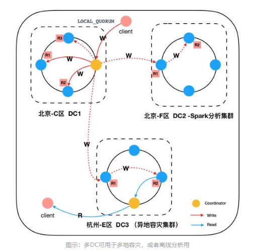
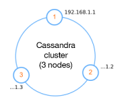
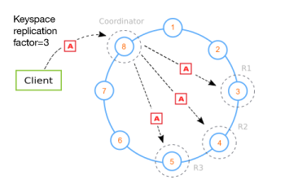
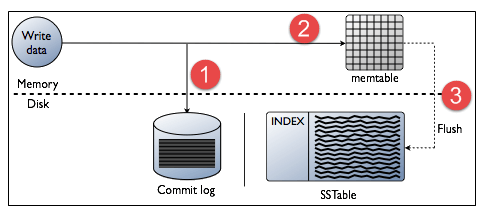
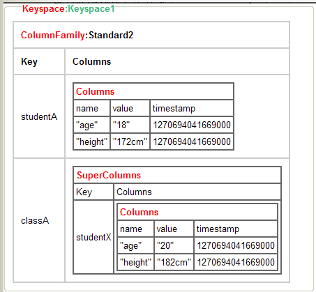
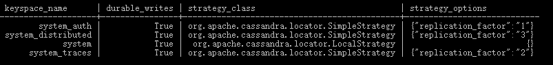

# Cassandra简介

Cassandra是一款分布式的结构化数据存储方案(NoSql数据库)，存储结构比Key-Value数据库（像Redis）更丰富，但是比Document数据库（如Mongodb）支持度有限；适合做数据分析或数据仓库这类需要迅速查找且数据量大的应用。

## 架构简介

Cassandra的主要组成部分：

- **节点（Node）**：Cassandra节点是存储数据的地方。每个节点是独立的，同时与其他节点互连；
- **数据中心（Data Center）**：数据中心是相关数据的集合；
- **集群（Cluster）**：集群是包含一个或多个数据中心的组件；
- **提交日志（Commit log）**：主要记录客户端提交过来的数据以及操作。这个数据会被持久化到磁盘中，是一种崩溃恢复机制。
- **存储表（Mem-table）**：内表是内存驻留的数据结构。提交日志后，数据将被写入内存表。
- **SSTable**：A sorted stringtable(SSTable)是一个不可变的数据文件，Cassandra将memtables定期的写入其中。
- **布隆过滤器（Bloom filter）**：这些只是快速，非确定性的，用于测试元素是否是集合成员的算法。 它是一种特殊的缓存。 每次查询后都会访问Bloom过滤器。

### 节点、数据中心与集群

一个集群包含一个或多个数据中心（DC），一个数据中心是相关数据节点的集合，节点是存储数据的地方。

一个分布式cassandra集群如下如所示：



典型的 Cassandra 网络拓扑结构包含一个节点集群（也称为 Cassandra 环），每个节点在不同物理服务器上的不同网络地址中运行。



- 在Cassandra中，每个节点是独立的，同时与其他节点互连。 集群中的所有节点都扮演着相同的角色。

- 集群中的每个节点都可以接受读取和写入请求，而不管数据实际位于集群中的位置。

- 在一个节点发生故障的情况下，可以从网络中的其他节点提供读/写请求，因此没有单点故障。

数据中心可以是一个物理数据中心或虚拟数据中心。不同的工作负载应该使用单独的数据中心，无论是物理的还是虚拟的。复制是由数据中心设置的。使用单独的数据中心可以防止Cassandra的事务受到其他工作负载的影响，并将请求保持在较低的等待时间。根据复制因素，可以将数据写入多个数据中心。数据中心永远不能跨越物理位置。

### 复制数据

下图所示：包含 8 个节点的 Cassandra 集群收到一个客户端连接，该连接将数据写入一个配置了复制系数 3 的键空间中。



所有数据都依据一个哈希算法均匀分布在 Cassandra 环（节点）中，以创建所需的副本（也称为*复制品*）数量。复制系数是集群配置的一个重要方面。该系数是通过一个键空间或模式配置来定义的。

### 写数据

节点的每个写入活动都由写入节点的提交日志捕获。 之后，数据将被捕获并存储在内存表中。 每当内存表已满时，数据将被写入SStable数据文件。 所有写入在整个集群中自动分区和复制。 Cassandra定期整合SSTables，丢弃不必要的数据。



## 数据模型

**Cassandra 的数据模型图：**



**基本概念：**

- **Cluster**：Cassandra 的节点实例，它可以包含多个Keyspace。
- **Keyspace**：用于存放 ColumnFamily 的容器，相当于关系数据库中的 Schema 或 database。
- **ColumnFamily**：用于存放 Column 的容器，类似关系数据库中的 table 的概念 。
- **SuperColumn**：它是一个特列殊的 Column, 它的 Value 值可以包函多个Column。
- **Column**：Cassandra 的最基本单位。由name , value , timestamp组成。

与关系型数据库对比理解，类似于：

**Cassandra的 keyspace：columnFamily：column，对应关系型数据库的database：table：column。**

### cluster（集群）

Cassandra数据库分布在几个一起操作的机器上。最外层容器被称为群集。对于故障处理，每个节点包含一个副本，如果发生故障，副本将负责。Cassandra按照环形格式将节点排列在集群中，并为它们分配数据。

### keyspace（键空间）

keyspace 是Cassandra中数据的最外层容器。Cassandra中的一个键空间的基本属性是：

- **Replication factor（复制因子）**：集群中的副本数量也就是复制因子。如果设置为1，则表示每一行只有一个副本，以此类推。所有的副本地位都是相等的， 没有主从之分。副本是存储在不同的节点上的，**副本因子最多不可以超过节点的数量**，否则写操作会被拒绝。

- **Replica placement strategy（副本放置策略）**：为了保证可靠性，一般要将数据写N份，其中一份写在其对应的节点上（由数据分片策略决定），另外N-1份如何存放，需要有相应的备份策略。

  - **SimpleStrategy（简单策略）**：只能用于一个数据中心的情况。SimpleStrategy 把第一份数据放到哪个节点取决于分割器，其他的副本放到环中顺时针的下一个节点。

  - **NetworkTopologyStrategy（网络拓扑策略）**：这种策略用于当你知道节点如何在数据中心(Data Center)分组的情况或者你希望部署集群横跨多个数据中心，此时你必须指定每个数据中心要多少个副本，(一般推荐设为2或者3）。在这种情况下，副本放置策略由数据中心自己决定。


### ColumnFamily（列家族）
键空间是一个或多个列族的列表的容器。列族是有序收集行的容器。每一行又是一个有序的列集合。列族表示数据的结构。


# 查询语言（CQL）

- [The Cassandra Query Language (CQL)](http://cassandra.apache.org/doc/latest/cql/index.html)
- [Data Definition](http://cassandra.apache.org/doc/latest/cql/ddl.html)
- [CQL reference](https://docs.datastax.com/en/cql-oss/3.3/cql/cql_reference/cqlReferenceTOC.html)


## 数据类型

CQL提供了一组丰富的内置数据类型，包括集合类型。除了这些数据类型，用户还可以创建自己的自定义数据类型。

[Cassandra CQL数据类型](https://www.w3cschool.cn/cassandra/cassandra_cql_datatypes.html)

Cassandra提供了数据可以自动过期的功能。

在数据插入期间，您必须以秒为单位指定“`ttl`”值。 ‘`ttl`‘值是数据生存价值的时间。 在这段时间之后，数据将被自动删除。

## keyspace 操作

**keyspace基本操作**：

- **CREATE KEYSPACE** ：在Cassandra中创建KeySpace。
- **USE** ：连接到已创建的KeySpace。
- **ALTER KEYSPACE** ：更改KeySpace的属性。
- **DROP KEYSPACE** ：删除KeySpace。
- **DESCRIBE KEYSPACES**：展示keyspaces列表。
- **DESCRIBE KEYSPACE**：展示已连接的keyspace的信息。

**keyspace 的属性**：

- **replication**：复制选项用于指定副本位置策略和所需副本的数。
- **durable_writes**：使用此选项，可以指示Cassandra是否对当前KeySpace的更新使用commitlog。此选项不是强制性的，默认情况下，它设置为true。

可以从查询语句中查看：

```
select * from system.schema_keyspaces;
```



### 创建keyspace

语句：

```sql
ALTER  KEYSPACE keyspace_name 
   WITH REPLICATION = { 
      'class' : 'SimpleStrategy', 'replication_factor' : N  
     | 'class' : 'NetworkTopologyStrategy', 'dc1_name' : N [, ...] 
   }
   [AND DURABLE_WRITES =  true|false] ;
```

即：

```sql
CREATE KEYSPACE “KeySpace Name”
WITH replication = {'class': ‘Strategy name’, 'replication_factor' : ‘No.Of  replicas’}
AND durable_writes = ‘Boolean value’;
```

### 修改keyspace

语句和create keyspace相似：

```sql
ALTER KEYSPACE <identifier> WITH <properties>
```

即：

```sql
ALTER KEYSPACE “KeySpace Name”
WITH replication = {'class': ‘Strategy name’, 'replication_factor' : ‘No.Of  replicas’};
AND durable_writes = ‘Boolean value’;
```

### 删除keyspace

```
DROP KEYSPACE “KeySpace name”
```


## 表操作

**表基本操作**：

- **CREATE TABLE**：在KeySpace中创建表。
- **ALTER TABLE**：修改表的列属性。
- **DROP TABLE**：删除表
- **TRUNCATE** ：从表中删除所有数据
- **CREATE INDEX**：在表的单个列上定义新索引。
- **DROP INDEX** ：删除命名索引。
- **describe tables/desc tables**：展示keyspace下所有的表
- **describe table table_name**：展示建表语句

### 创建表

语句：

```sql
CREATE (TABLE | COLUMNFAMILY) <tablename>  
('<column-definition>' , '<column-definition>')  
(WITH <option> AND <option>)
```

一般建表都会确定主键和排序：

主键：

- **单个主键**：对单个主键使用以下语法。

```sql
Primary key (ColumnName)
```

- **复合主键**：对复合主键可使用以下语法。

```sql
Primary key(ColumnName1,ColumnName2 . . .)
```

排序：

```
WITH CLUSTERING ORDER BY (column1 ASC/DESC, column2 ASC/DESC)
```

### 修改表

语句：

```sql
ALTER (TABLE | COLUMNFAMILY) <tablename> <instruction>
```

使用ALTER命令可以执行添加/删除列操作。

- **添加列**

  ```sql
  ALTER TABLE table name
  ADD  new column datatype;
  ```

- **删除列**

  ```SQL
  ALTER table name
  DROP column name;
  ```

### 删除表

语法 ：

```sql
DROP TABLE <tablename>
```

### 截断表

语法 ：

```sql
TRUNCATE <tablename>
```

一般用户清空表数据。

### 创建索引

```sql
CREATE INDEX <identifier> ON <tablename>
```

### 删除索引

```sql
DROP INDEX <identifier>
```


## CURD

- **INSERT** -在表中添加行的列。
- **UPDATE** -更新行的列。
- **DELETE** -从表中删除数据。
- **BATCH** -一次执行多个DML语句。


# 资料

> [为什么选择Cassandra](https://zhuanlan.zhihu.com/p/78255146)
> [cassandra架构](https://segmentfault.com/a/1190000015610357)
> [Apache Cassandra架构理解](https://zqhxuyuan.github.io/2015/08/25/2015-08-25-Cassandra-Architecture/)
> [Cassandra 的配置详解](https://www.ibm.com/developerworks/cn/opensource/os-cn-cassandraxu1/)
> [一致性哈希算法及其在分布式系统中的应用](http://blog.codinglabs.org/articles/consistent-hashing.html)
> https://www.sypopo.com/post/7Do12b2RQw/
> https://blog.csdn.net/yuanjian0814/article/details/78772245

