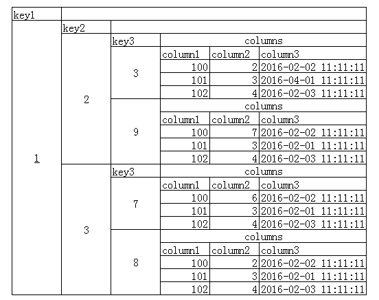
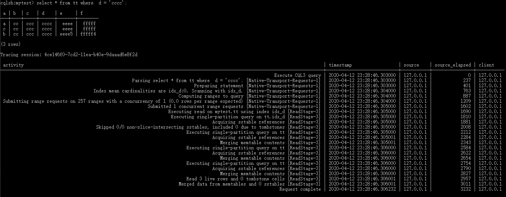
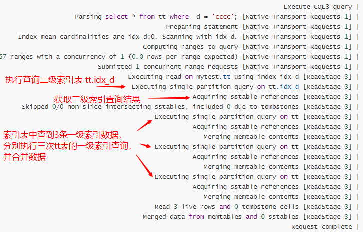
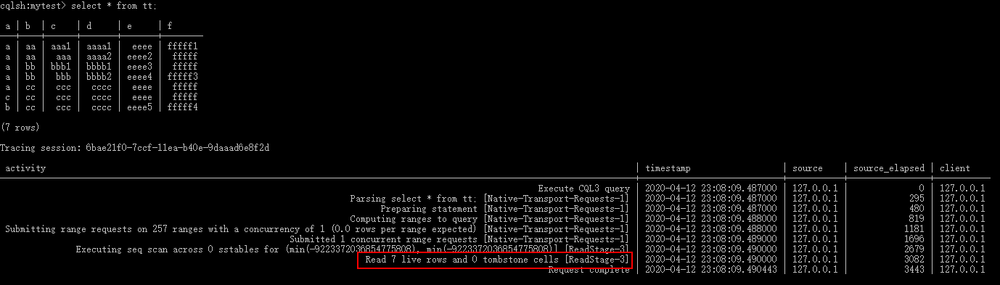
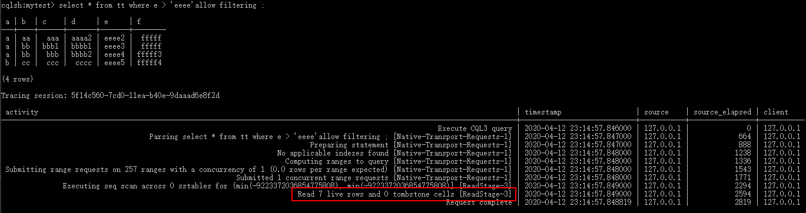
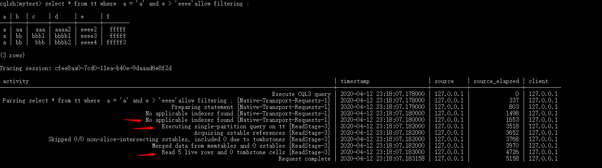
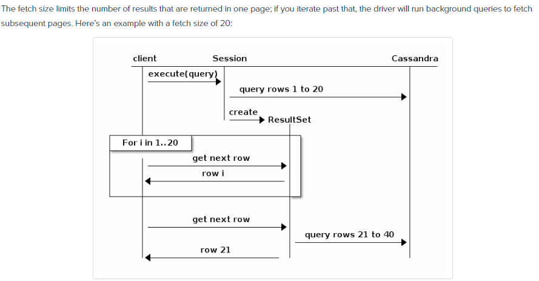

> 处于性能的考虑，cassandra对索引、排序和分页功能支持都比较简单且限制较多，不能希望cassandra能做到关系型数据库那样灵活的查询。

先定义一个测试用demo表：

```sql
CREATE KEYSPACE mytest 
    WITH replication = {'class': 'SimpleStrategy', 'replication_factor': '3'}  
    AND durable_writes = true;

create table mytest.tt(
    a text,
    b text,
    c text,
    d text,
    e text,
    f text,
    g timestamp,
    primary key ( a, b, c )
)with clustering order by(b asc, c desc);

create index if not exists idx_d on tt(d);

insert into tt (a,b,c,d,e,f,g) values ('a', 'aa', 'aaa', 'aaaa1','eeee1', 'fffff', '2013-01-01 00:05:01.500');
insert into tt (a,b,c,d,e,f,g) values ('a', 'aa', 'aaa1', 'aaaa1','eeee', 'fffff1', '2014-01-01 00:05:01.500');
insert into tt (a,b,c,d,e,f,g) values ('a', 'aa', 'aaa', 'aaaa2','eeee2', 'fffff', '2015-01-01 00:05:01.500');
insert into tt (a,b,c,d,e,f,g) values ('a', 'bb', 'bbb', 'bbbb1','eeee', 'fffff2', '2016-01-01 00:05:01.500');
insert into tt (a,b,c,d,e,f,g) values ('a', 'bb', 'bbb1', 'bbbb1','eeee3', 'fffff', '2017-01-01 00:05:01.500');
insert into tt (a,b,c,d,e,f,g) values ('a', 'bb', 'bbb', 'bbbb2','eeee4', 'fffff3', '2018-01-01 00:05:01.500');
insert into tt (a,b,c,d,e,f,g) values ('a', 'cc', 'ccc', 'cccc','eeee', 'fffff', '2019-01-01 00:05:01.500');
insert into tt (a,b,c,d,e,f,g) values ('b', 'cc', 'ccc', 'cccc','eeee5', 'fffff4', '2020-01-01 00:05:01.500');
insert into tt (a,b,c,d,e,f,g) values ('c', 'cc', 'ccc', 'cccc','eeee', 'fffff', '2021-01-01 00:05:01.500');
```

# 主键

> [CREATE TABLE](http://cassandra.apache.org/doc/latest/cql/ddl.html#create-table)
> [cassandra简单介绍与基本操作](https://www.cnblogs.com/youzhibing/p/6549960.html)
> [[Cassandra教程] （四）使用Key的正确姿势](https://www.flyml.net/2016/09/05/cassandra-tutorial-right-way-to-use-key/)

一个CQL的主键由两部分组成：**分区键**和**群集列**。

- **partition key（分区键）**：它是主键定义的第一个组件，它可以是单列，也可以是多列（复合分区键），每个表必须有一个分区键。
- **clustering columns（群集列）**：群集列是主键定义中在分区键之后的列，表的集群列定义了该表分区的集群顺序。对于一个给定的分区，所有的行在Cassandra中都是按照这个聚类顺序进行物理排序的。

主键定义示例：

- **PRIMARY KEY (a)**：a是分区键，没有群集列。
- **PRIMARY KEY (a, b, c)**：a是分区键，b和c是群集列。
- **PRIMARY KEY ((a, b), c)**：a和b组成分区键（通常称为复合分区键），c是集群列。

方便理解主键和数据存储结构之间的关系，可以通过下面的demo表和数据结构图理解：

```
CREATE TABLE mykeyspace.mytable (
    key1 text,
    key2 text,
    key3 text,
    column1 bigint,
    column2 int,
    column3 timestamp,
    PRIMARY KEY (key1, key2, key3)
);
```

其中，key1 是分区主键，key2和key3 是集群列主键



从上图的数据结构图来理解，可以看出，cassandra库的数据根据每一级的主键来隔离数据区间，好比关系型数据库中的表分区存储结构。


# 二级索引

> [CREATE INDEX](http://cassandra.apache.org/doc/latest/cql/indexes.html)
> [When to use an index](https://docs.datastax.com/en/archived/cql/3.1/cql/ddl/ddl_when_use_index_c.html)
> [[Cassandra教程] （十）二级索引(Secondary Index)](https://www.flyml.net/2016/09/16/cassandra-tutorial-secondary-index/)

Cassandra支持创建二级索引，可以创建在除了第一主键(分区键：partition key)之外所有的列上。一级索引就是主键primary key，而二级索引是辅助索引，辅助查找到一级索引，然后通过一级索引查找到真正的数据。

创建语句：

```
CREATE INDEX [ IF NOT EXISTS ] index_name
	ON keyspace_name.table_name ( KEYS ( column_name ) )
	[ USING string [ WITH OPTIONS = map_literal ] ]
```

当创建一个索引，cassandra 会创建一个隐藏table来存储数据，存储的数据是二级索引对应的一级索引。

**索引执行过程分析**

1. 首先开启cql 的 [tracing](http://cassandra.apache.org/doc/latest/tools/cqlsh.html#tracing)

   ```sql
   cqlsh:mytest> tracing on
   Now Tracing is enabled
   ```

2. 分析查询

   ```sql
   select * from tt where  d = 'cccc';
   ```

   执行结果如下图所示：

   

   

   

从上面分析可知：

- 创建索引时，cassandra会创建一个不可见的表，存放可以通过二级索引查询到一级索引的数据。
- 查询索引时，cassandra会先从对应的索引表中查出所有的一级索引数据，然后分别执行各个一级索引查询语句，最终合并数据得到结果。

**所以，选择索引列时尽量要避免选择使用一条索引命中大量结果的列。**

# 排序

> The clustering order of a table is defined by the clustering columns of that table. By default, that ordering is based on natural order of those clustering order, but the CLUSTERING ORDER allows to change that clustering order to use the reverse natural order for some (potentially all) of the columns.(表的聚类顺序由该表的聚类列定义。默认情况下，该顺序基于这些群集顺序的自然顺序，但"CLUSTERING ORDER"允许更改该群集顺序，以便对某些（可能是所有）列使用反向自然顺序。)

- **默认顺序：ASC**。如果未使用CLUSTERING ORDER选项，默认群集列使用ASC排序。

- **查询排序限制**

  - 必须有分区键的=号查询；分区键是决定记录分布在哪台机器上，也就是说cassandra只支持单台机器上的记录排序。

  - 严格按群集列定义顺序查询；参与排序的集群列必须严格按照定义的先后顺序使用，只能是先二、再三、再四…这样的顺序，有四，前面必须有三；有三，前面必须有二，以此类推。

  - 严格按照相同或相反的排序规则；参与排序的集群列要么与建表时指定的顺序一致，要么全部相反。

    ```sql
    比如定义：WITH CLUSTERING ORDER (a DESC, b ASC)
    1.ORDER BY (a DESC, b ASC)（正确，和建表顺序一致）
    2.ORDER BY (a ASC, b DESC)（正确，和建表顺序相反）
    3.ORDER BY (a ASC, b ASC) （错误）
    4.ORDER BY (a DESC, b DESC)（错误）.
    ```

  - 不能有索引查询。

  按照demo表的定义，以下查询语句：

  | 查询语句                                                     | 说明                                                 |
  | ------------------------------------------------------------ | ---------------------------------------------------- |
  | select * from tt order by b asc;                             | 错误，没有分区键                                     |
  | select * from tt where a = 'a' order by b asc;               | 正确                                                 |
  | select * from tt where a = 'a' order by b desc ;             | 正确                                                 |
  | select * from tt where a = 'a' order by c desc ;             | 错误，按照群集列定义顺序使用，需要在c之前声明b的排序 |
  | select * from tt where a = 'a' order by b asc,c desc ;       | 正确                                                 |
  | select * from tt where a = 'a' order by c asc,b desc ;       | 错误，没有按照群集列定义顺序使用                     |
  | select * from tt where a = 'a' order by b asc ,c asc ;       | 错误，不是与建表时指定的排序完全一致或者完全相反     |
  | select * from tt where a = 'a' order by b desc ,c asc ;      | 正确，和建表顺序完全相反                             |
  | select * from tt where a = 'a' and d = 'bbbb' order by b asc,c desc; | 错误，带有索引列查询条件                             |

  

# 查询

> [Data Manipulation - SELECT](http://cassandra.apache.org/doc/latest/cql/dml.html#select)
>
> https://docs.datastax.com/en/archived/cql/3.1/cql/cql_reference/select_r.html


## 主键查询

从上面主键说明中可以大概地解到Cassandra的主键设计和数据结构图之间的关系如下图所示：


由此图可以看出，数据被一级级的primary key 分割成一层层的数据块。这种结构使得在查询时，**主键条件也要一级级的带着使用，不能跳过中间任何一级**，必须上一层主键明确后，才能使用下一层的主键。

以下查询使用demo表来演示。

### equal 查询

使用规则：

- **主键条件也要一级级的带着使用，不能跳过中间任何一级**，必须上一层主键明确后，才能使用下一层的主键。

```sql
-- 正确查询，主键条件一级级带着使用，能确定查询的数据在哪一层的数据中
select * from tt where a = 'a';
select * from tt where a = 'a' and b = 'aa'
select * from tt where a = 'a' and b = 'aa' and c = 'aaa' ;
select * from tt where a = 'a' and c = 'aaa' and  b = 'aa';
-- 错误查询，主键条件不是一级级带着使用，存在跳级
select * from tt where b = 'a';
select * from tt where a = 'a'and c = 'aaa';
```

### non-equal 查询

non-equal 查询是指带“<”、“<=”、“>”、“>=” 的范围查询，是用于群集列主键上的范围查询，分区主键不能直接使用non-equal 查询。

non-equal 查询使用规则：

- **要严格按照一层层主键连贯使用规则**；
- **只能使用在群集列上，不能使用在分区主键**，索引列和普通列使用，需要加allow filtering；
- **non-equal 查询只能用于查询条件中的最后一个使用的群集列键上**

```sql
-- 正确查询:
select * from tt where a = 'a' and b >= 'bb' ;
select * from tt where a = 'a' and b >= 'bb' and b <'dd';
select * from tt where a = 'a' and b = 'aa' and c >= 'aa';
select * from tt where a = 'a' and b = 'aa' and c >= 'aa' and c <'ccc';
-- 错误查询:
select * from tt where a > 'a'; -- 分区键不能使用non-EQ查询
select * from tt where a = 'a' and c >= 'bb'; -- 主键跳级
select * from tt where a = 'a' and b >= 'aa' and c = 'aa'; -- 集群列b已经是non-EQ查询了，c不能再做条件
select * from tt where a = 'a' and b >= 'aa' and c = 'aa' allow filtering; -- 原因同上，non-EQ条件只能用于查询条件中的最后一个使用的群集列键上
select * from tt where a = 'a' and d < 'c'; -- 不能使用在非primary key 列上**
```

同时，还可以使用群集列group组合查询：

```sql
select * from tt where a = 'a' and (b,c) > ('cc', 'aa');
select * from tt where a = 'a' and (b,c) <= ('cc', 'aa');
```

### IN 查询

IN 查询使用规则：

- 同样**要严格按照一层层主键连贯使用规则**，但不像non-EQ查询那样只能用在最后一个使用的群集列中。
- **可以用于分区键和群列键上，IN被视为相等关系**，不能使用在索引和普通列上。

```sql
-- 正确查询
select * from tt where a in( 'a', 'b', 'c');
select * from tt where a in( 'a', 'b', 'c') and b = 'aa';
select * from tt where a in( 'a', 'b', 'c') and b in ('aa', 'bb') ;
select * from tt where a in( 'a', 'b', 'c') and b in ('aa', 'bb') and c in('aaa','ccc');
select * from tt where a in( 'a', 'b', 'c') and b = 'aa' and c in('aaa','ccc');
-- 错误查询
select * from tt where a in( 'a', 'b', 'c') and c = 'aa'; --存在跳级，需要先明确群集列b的条件
select * from tt where a in( 'a', 'b', 'c') and c in ('aa','bb'); --存在跳级
select * from tt where a in( 'a', 'b', 'c') and b = 'aa' and d in('cccc'); -- in不能使用在非primary key列上
```

我理解，IN查询是属于明确查询，明确了落在每一层主键的数据块，所以能在每一层的主键上使用，不像non-EQ那样有限制。

### ALLOW FILTERING 查询

Cassandra的查询能力比较简单且严格，必须查询条件要明确primary key 或者索引（辅助索引的目的最终也是找到对应的primary key），对于普通列的查询，需要使用`allow filtering`。

**注意：**不同版本的cassandra版本对allow filtering 的支持不一样，以下是在cassandra 3.0+版本测试的。

直接用非primary key 或非索引列作查询条件，cassandra会报错：

```
cqlsh:mytest> select * from tt where e = 'eeee';
InvalidRequest: Error from server: code=2200 [Invalid query] message="Cannot execute this query 
as it might involve data filtering and thus may have unpredictable performance. If you want to 
execute this query despite the performance unpredictability, use ALLOW FILTERING"
```

但是可以加上 allow filtering 查询：

```sql
select * from tt where e = 'eeee' allow filtering ;
```

**使用场景**

- 普通列的条件查询，支持equal查询和non-equal查询

  ```
  select * from tt where e = 'eeee' and f > 'ffff' allow filtering ;
  ```

- 不连贯的 primary key。

  如上面主键使用说明中描述的，primary key查询条件需要连贯使用，不能跳级。

  ```sql
  select * from tt where a = 'a' and c >= 'bb'; -- 主键跳级，需要先明确群集列b的条件
  select * from tt where a = 'a' and c >= 'aa' allow filtering ; -- 允许
  ```

  但是可以加上allow fitering 查询，那么群集列c会当成普通列使用。

**性能问题**

`ALLOW FILTERING`的作用，相当于在primary key和索引查询条件的的结果集中再筛选结果，是一种非常消耗计算机资源的查询方式。需要根据结果集的量级和使用场景来考虑性能问题。

- 如果表中包含例如100万行，并且其中95％具有满足查询条件的值，则查询仍然相对有效，您应该使用ALLOW FILTERING。

- 如果您的表包含100万行，并且只有2行包含满足查询条件值，则查询效率极低。更推荐的做法是在该列上添加索引。

可以看下cql的执行过程。

首先开启cql 的 [tracing](http://cassandra.apache.org/doc/latest/tools/cqlsh.html#tracing)

```sql
cqlsh:mytest> tracing on
Now Tracing is enabled
```

- 全表扫描：

```sql
select * from tt;
```



可以看到：Read 7 live rows and 0 tombstone cells （读取7个存活行和0个墓碑单元格）

- 没有primary key和索引，但带allow filtering的查询：

```
select * from tt where e > 'eeee'allow filtering ;
```



结果集只返回了4行，但同样是：Read 7 live rows and 0 tombstone cells （读取7个存活行和0个墓碑单元格）

- 带primary key 和 allow filtering 的查询

```sql
select * from tt where  a = 'a' and e > 'eeee'allow filtering ;
```



可以看到的细节有：

```
No applicable indexes found [Native-Transport-Requests-1] （没有可应用的索引）
Executing single-partition query on tt [ReadStage-3]（在tt上执行单分区查询）
Read 5 live rows and 0 tombstone cells [ReadStage-3]（读取5个存活行和0个墓碑单元格）
```

结果返回了3行数据，但在primary key查询下，只读到5行数据。

从上面分析可知：`ALLOW FILTERING`的作用，相当于在primary key和索引查询条件的的结果集中再筛选结果，如果结果集量很大，并且allow fitering的命中率很低时，将十分消耗计算机资源。

### TOKEN查询

> Not all relations are allowed in a query. For instance, non-equal relations (where `IN` is considered as an equal relation) on a partition key are not supported (but see the use of the `TOKEN` method below to do non-equal queries on the partition key).

分区键上支持equal查询和IN 查询，不允许non-EQ查询，但是可以根据情况使用token函数，达到在分区键上实现non-EQ查询。

> When specifying relations, the `TOKEN` function can be used on the `PARTITION KEY` column to query. In that case, rows will be selected based on the token of their `PARTITION_KEY` rather than on the value. Note that the token of a key depends on the partitioner in use, and that in particular the RandomPartitioner won’t yield a meaningful order. Also note that ordering partitioners always order token values by bytes (so even if the partition key is of type int, `token(-1) > token(0)` in particular).

注意，排序分区器总是按字节排序标记值（因此，token（-1）>token（0）)。

```sql
select * from tt where token(a) > token('a') and token(a) < token('c');
```


## 索引查询

**索引查询仅支持equal查询，不支持non-equal和in查询。**如果在索引列使用non-equal查询，需要用allow filtering，当成普通列查询。


## 分页查询

> https://docs.datastax.com/en/developer/java-driver/3.6/manual/paging/

在mysql中分页可以简单使用：`select * from table limit m,n `来实现。其中其中m是指记录开始的index，n是指偏移量。但在cassandra中分页查询是一件十分麻烦的事情，虽然cassandra 支持 limit查询，但是它只能限制查询结果的条数，而不能指定从哪里开始。所以需要确定一个分页起始点。

cassandra分页查询的主要流程如下图所示，总的来说就是：要查询下一页的数据需将上一页的最后一行数据作为起始点，结合limit使用，得到下一页的数据。



分页查询中，另外一个难点是：排列顺序。

- 主键排列顺序：token函数（ token('value') ）可以通过分区键的值来计算出该值在集群中放置对应的行，然后通过non-EQ实现排序。
- 群集列顺序：群集列决定了分区内数据的排列顺序，不同的群集列可以指定不同的排序方式。

不同的群集列可以指定不同的排列方式，会导致不同的分页方法，复杂程度十分不一样，要慎重选择群集列的排列方式。

**最简单的方法就是，将群集列的排序方式统一成同一个**。


## 模糊查询

> Using CQL, SSTable attached secondary indexes (SASI) can be created on a non-collection column defined in a table. Secondary indexes are used to query a table that uses a column that is not normally queryable, such as a non primary key column. SASI implements three types of indexes, `PREFIX`, `CONTAINS`, and `SPARSE`.
>
> [Using a SSTable Attached Secondary Index (SASI)](https://docs.datastax.com/en/dse/5.1/cql/cql/cql_using/useSASIIndex.html)
> https://www.bbsmax.com/A/A2dmV4Exze/

cassandra实现模糊查询是要对模糊查询的列创建SASI索引，该索引限制：

- non-collection column ：不能在集合类型的列上创建；
- non primary key column：不能再primary key列上创建；

SASI索引有三种： `PREFIX`, `CONTAINS`, 和 `SPARSE`.

**PREFIX index**

PREFIX index ，顾名思义就是前缀索引，仅支持前缀模糊匹配模式。

创建prefix index

```sql
create custom index idx_prefix_e on mytest.tt(e)
    USING 'org.apache.cassandra.index.sasi.SASIIndex';
```

**注意：**如果在集合列或primary key上创建，在使用时会报错：“LIKE restriction is only supported on properly indexed columns.“

支持前缀词匹配查询：

```sql
select * from tt where e = 'eeee';
select * from tt where e like 'e%';
select * from tt where e like 'eeee2%';
```

不支持后缀词匹配查询和包含匹配查询：

```
select * from tt where e like '%e';
select * from tt where e like '%e%';
```

会报错：e LIKE '%<term>' e is only supported on properly indexed columns

**CONTAINS index**

创建SASI索引时，指定使用CONTAINS 模式，可以让该索引支持包含匹配查询。

```sql
create custom index idx_contains_f on mytest.tt(f)
    USING 'org.apache.cassandra.index.sasi.SASIIndex'
    WITH OPTIONS = { 'mode': 'CONTAINS' };
```

支持查询：

```
select * from tt where f like '%f3%';
```

以下查询会失败，虽然不会报错，但是查出来的数据是不正确：

```sql
select * from tt where f = 'ffff1';  
select * from tt where f like '%ffff1'; 
select * from tt where f like 'ffff3%'; 
```

分开prefix模式和contain模式是基于查询性能考虑。Cassandra在设计的时候会避免一切减慢scalable的可能性，prefix 效率比contains要高。

**注意：无论是PREFIX还是CONTAINS模式，默认大小写是敏感的，但是可以修改配置`case_sensitive`**

```sql
create custom index idx_contains_f on mytest.tt(f)
    USING 'org.apache.cassandra.index.sasi.SASIIndex'
    WITH OPTIONS = { 
    'mode': 'CONTAINS',
    'analyzer_class': 'org.apache.cassandra.index.sasi.analyzer.NonTokenizingAnalyzer',
    'case_sensitive': 'false'
    };
```


**SPARSE index**

> The `SPARSE` index is meant to improve performance of querying large, dense number ranges like timestamps for data inserted every millisecond. If the data is numeric, millions of columns values with a small number of partition keys characterize the data, and range queries will be performed against the index, then `SPARSE` is the best choice. For numeric data that does not meet this criteria, `PREFIX` is the best choice.

SPARSE index，稀疏索引，旨在提高查询大型密集数字范围（如每毫秒插入的数据的时间戳）的性能。如果数据是数值型的，那么具有少量分区键的数百万列值将描述数据的特征，并且范围查询将针对索引执行，那么稀疏是最佳选择。对于不符合此条件的数字数据，前缀是最佳选择。

创建索引：

```sql
create custom index idx_sparse_g on mytest.tt(g)
    USING 'org.apache.cassandra.index.sasi.SASIIndex'
    WITH OPTIONS = { 'mode': 'SPARSE' };
```

sparse索引不支持`like`查询，支持的是non-EQ查询： `>=`, `>` and `<=` 。

```sql
select * from tt where g >= '2015-12-31 16:05:01';
```


## 总结

sql的查询条件主要分三部分，第一部分是primary key列的查询，第二部分是索引列的查询，最后是普通列的查询。

- primary key列查询，支持equal、non-EQ和IN查询，但是要求primary key要连贯使用，最后一个primary key才能使用 non-EQ查询。
- 索引列查询，仅支持equal查询。不允许使用 IN 查询。如果索引列上使用non-EQ查询但会被当成普通列使用，需要加 allow filtering。
- 普通列的查询条件，需要加allow filtering，作用相当于在primary key和索引查询的结果集中再筛选结果，需要考虑性能问题。

Cassandra支持创建二级索引，二级索引是为了辅助找出对应的一级索引。分为普通索引和custom索引。

普通索引：

结合二级索引和allow filtering的执行过程分析：

- 当查询条件命中结果少时，适合使用索引；
- 当数据量大，且命中率大时，适合使用allow filtering；

custom索引（SASI）：

- 普通索引仅支持equal查询

- custom索引根据模式，可以支持equal、non-EQ和 like 查询，分为以下三类：
  - PREFIX index：支持equal和like查询；
  - CONTAIN index：仅支持like查询；
  - SPARSE index：仅支持non-EQ查询。

索引都不能建在primary key上。


# 资料

- [cassandra简单介绍与基本操作](https://www.cnblogs.com/youzhibing/p/6549960.html)
- [cassandra高级操作之索引、排序以及分页](https://www.cnblogs.com/youzhibing/p/6617986.html)
- [CREATE TABLE](http://cassandra.apache.org/doc/latest/cql/ddl.html#create-table)

