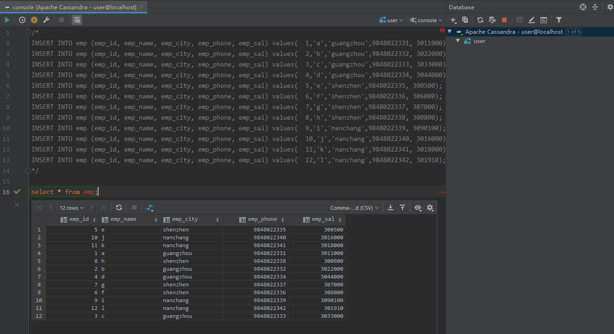

# IDEA
## 配置连接Cassandra

1. 打开IDEA的侧边栏工具【database】，点击【+】新增数据库，选择【Apache Cassandra】

   

2. 安装驱动。首次使用，IDEA会提示下载相应驱动，确认就好。

3. 配置Cassandra连接。

   
   配置完，点击【Test Connection】可以看到是否连接成功。
   
   

## 简单使用

IDEA中支持以下功能：

### console

新建一个query console，可以在上面执行cql。

