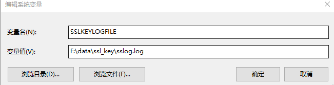
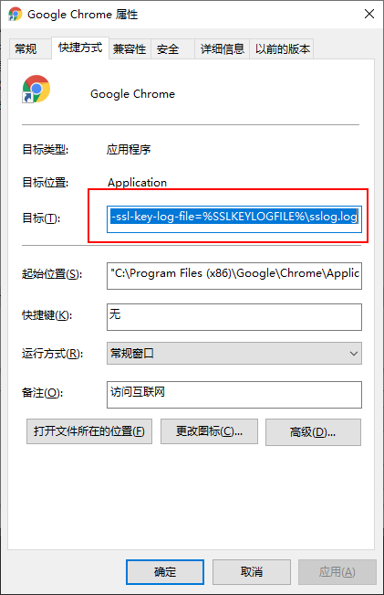
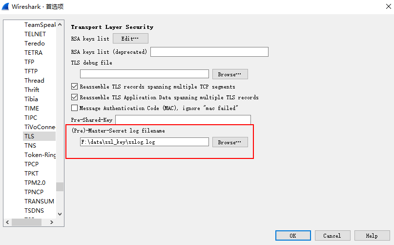
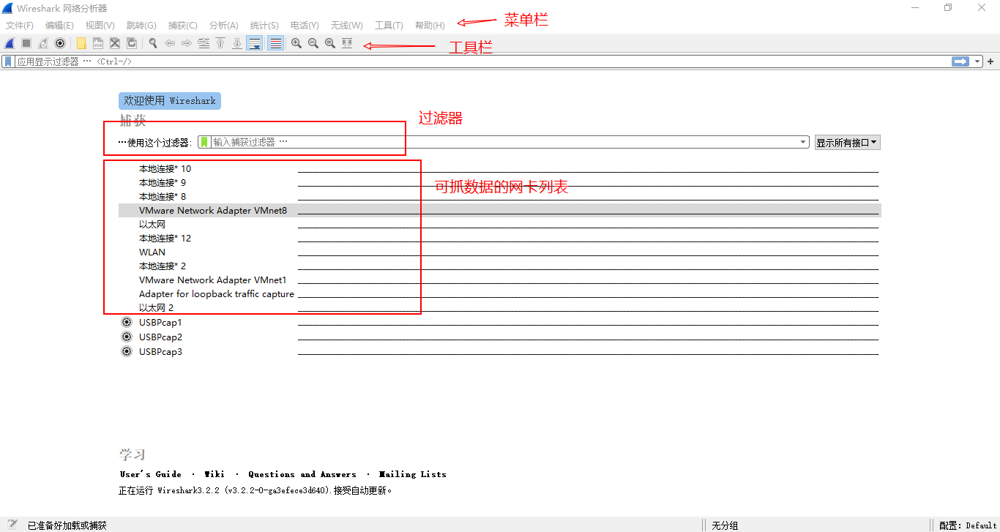
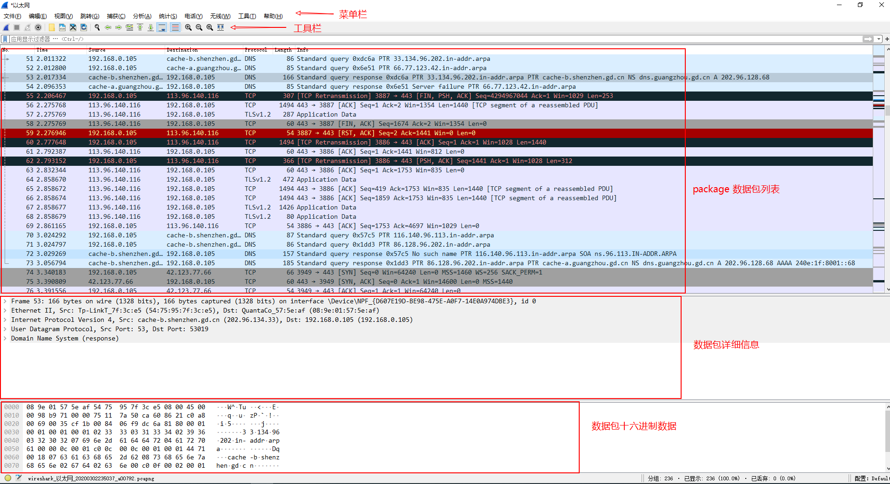
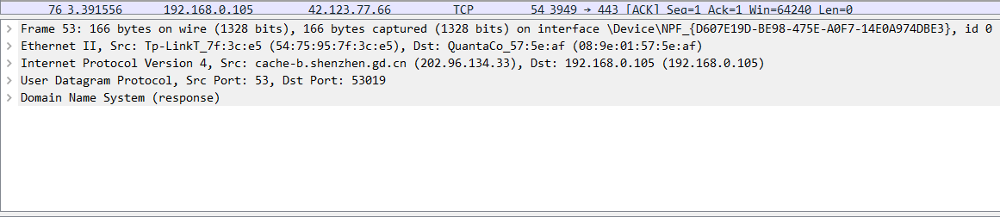
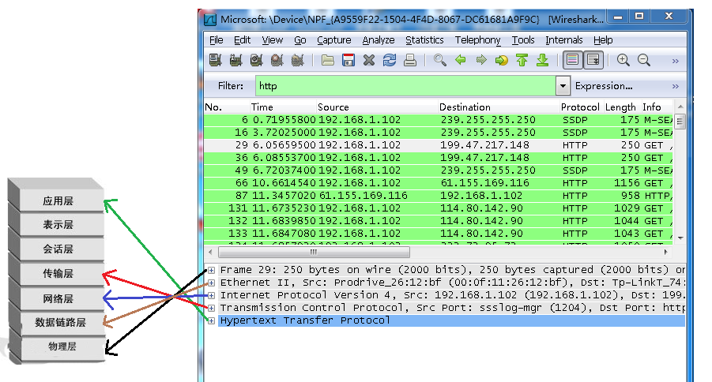
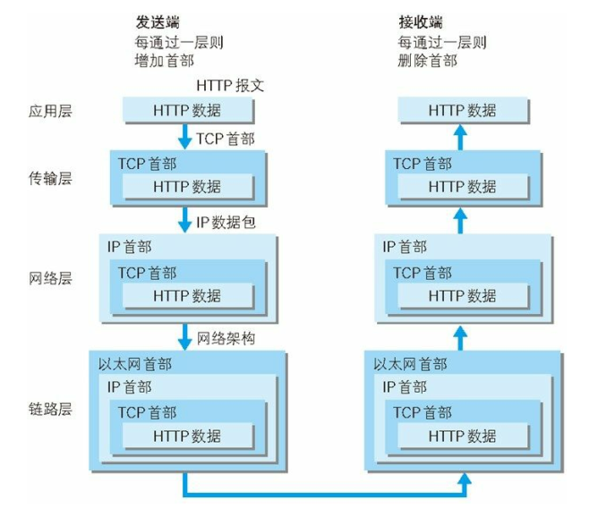

# wireshark简介

>  Wireshark（前称Ethereal）是一个网络封包分析软件。网络封包分析软件的功能是撷取网络封包，并尽可能显示出最为详细的网络封包资料。Wireshark使用WinPCAP作为接口，直接与网卡进行数据报文交换。


## 下载安装

需要安装wireshark和WinCap软件。

## windows环境

1. 安装wireshark，[wireshark下载地址](https://www.wireshark.org/download.html)。

2. 安装WinCap，[WinCap下载地址](https://www.winpcap.org/install/default.htm)。低版本wireshark在安装时，会提醒安装wincap，高版本没有。
3. 开启NPF服务。管理员身份启动cmd，执行命令 “net start npf”。


### 抓chrome的https包

1. 设置系统环境变量：SSLKEYLOGFILE，F:\data\ssl_key\sslog.log。

   

2. 改变chrome启动方式目标命令，设置sslkey日志文件。

   ```
   "C:\Program Files (x86)\Google\Chrome\Application\chrome.exe" --ssl-key-log-file=%SSLKEYLOGFILE%\sslog.log
   ```

   



3. wireshark设置TLS。菜单栏 --> 编辑--> 首选项 --> Protocols -->TLS，设置sslog.log路径。

   

   

4. 重启wireshark。

## 客户端界面



打开Wireshark后，可以看到四个基本区域：

- 菜单栏
- 工具栏可以开始捕获、停止捕获等操作
- 过滤器，能够在开始捕获前指定过滤规则

- 可以捕获的网络设备，双击其中一个设备后就开始进行网络流量的捕获

选择一个可用的网络设备，启动抓包，打开浏览器页面，就可以看到抓包的界面：



基本区域是：

- 菜单栏和工具栏
- 过滤器
- 请求列表，显示捕获到的封包， 有源地址和目标地址，端口号。
- 文本格式请求数据，展示各个协议的
- 原始请求数据，是十六进制数据

## 过滤器

> [官方过滤器说明文档](https://www.wireshark.org/docs/man-pages/wireshark-filter.html)

### 常用使用规则

#### 比较运算符

| 运算符 | 说明     |
| ------ | -------- |
| eq, == | 等于     |
| ne, != | 不等于   |
| gt, >  | 大于     |
| lt, <  | 小于     |
| ge, >= | 大于等于 |
| le, <= | 小于等于 |

#### 逻辑运算符

| 运算符   | 功能   |
| -------- | ------ |
| and, &&  | 与运算 |
| or, \|\| | 或运算 |
| not, !   | 非运算 |

例子：

```
    tcp.port == 80 and ip.src == 192.168.2.1
    not llc
    http and frame[100-199] contains "wireshark"
    (ipx.src.net == 0xbad && ipx.src.node == 0.0.0.0.0.1) || ip
```

#### 搜索和匹配运算符

| 运算符       | 说明                                                         |
| ------------ | ------------------------------------------------------------ |
| contains     | The "contains" operator allows a filter to search for a sequence of characters, expressed as a string (quoted or unquoted), or bytes, expressed as a byte array, or for a single character, expressed as a C-style character constant. |
| matches 或 ~ | The "matches" or "~" operator allows a filter to apply to a specified Perl-compatible regular expression (PCRE). The "matches" operator is only implemented for protocols and for protocol fields with a text string representation. Matches are case-insensitive by default. |

例子：

```
#包含URL
http contains "https://www.wireshark.org"
#匹配关键词
wsp.user_agent matches "cldc"
#匹配正则表达式
wsp.user_agent matches "(?-i)cldc"
```

#### 集合操作

格式：字段 in {value1, valu2.....}

```
 tcp.port in {80 443 8080}
 http.request.method in {"HEAD" "GET"}
 tcp.port in {443 4430..4434}
 ip.addr in {10.0.0.5 .. 10.0.0.9 192.168.1.1..192.168.1.9}
 frame.time_delta in {10 .. 10.5}
```

### 常用过滤场景

#### 过滤IP地址

```
ip.addr==192.168.1.3　　//只显示源/目的IP为192.168.1.3的数据包
not ip.src==1.1.1.1　　//不显示源IP为1.1.1.1的数据包
ip.src==1.1.1.1 or ip.dst==1.1.1.2　　//只显示源IP为1.1.1.1或目的IP为1.1.1.2的数据包
```

#### 过滤端口

```
tcp.port eq 80　　//只显示源/目的端口为80的数据包
tcp.dstport==80　　//只显示目的端口为80的数据包
tcp.srcport
tcp.port >=1 and tcp.port<=80　　//只显示源/目的端口大于等于1，小于等于80的数据包
```

####  过滤MAC地址

```
eth.dst==A0:00:00:04:C5:84　　//只显示目的MAC为A0:00:00:04:C5:84 的数据包
eth.addr eq A0:00:00:04:C5:84　　//作用同上
```

####  过滤协议类别

```
tcp、ip、dhcp、oicq、ftp、ssl等等
udp || icmp || dns　　//只显示udp、icmp、dns相关协议的数据包
not arp 等于 !arp　　//不显示arp协议的数据包
```

 #### 过滤协议参数

```
tcp.flags.syn == 0x02　　//显示包含syn标志位的数据包
frame.len==119　　//整个数据包长度,从eth开始到最后
http.request.method=="get"　　//显示http请求中method值为get的包
```


## package列表

### 着色规则

wireshark抓包列表中有着丰富的颜色，各种颜色表示不同的层级或情况，具体：


## package详细信息



- Frame：物理层的数据帧信息
- Ethernet II：数据链路以太网帧头信息
- Internet Protocol：IP协议头部信息
- Transmission Control Protocol：传输层T的数据段头部信息
- Hypertext Transfer Protocol：应用程序信息，http协议信息

一般对应TCP/IP分层模型：






# 参考资料

>感谢各位大佬的资料整理，小弟不才，按照自己的思绪再做整理。
>
>[wireshark doc](https://www.wireshark.org/docs/)
>
>https://www.cnblogs.com/koushuige/p/9212033.html
>
>https://www.cnblogs.com/Jesse-HOHO/p/7811585.html