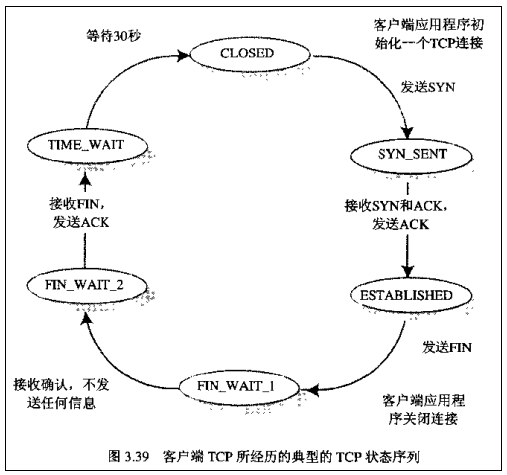

# TCP基础

## TCP 报文格式

- **Source port（源端口）**： 16位；

- **Destination portal（目的端口）**：16位；

- **Sequence number（序号）**：32位；

- **Acknowledgment number（确认号）**：32位；

- **Data offset（数据偏移量）**：4位。

  TCP报文段的首部长度，单位是word（4字节）。字面含义是：TCP报文段的数据的起始处，距离TCP报文段的起始处 的偏移量。4个字节最大能表示的数字是15，所以首部最大60字节。

- **Reserved（保留字段）**：3位。

- **Control bits（控制位）**：9位。

  一共9个标志位。

  | 标记位  | 说明                                                         |
  | ------- | ------------------------------------------------------------ |
  | **NS**  | **nonce sum**，该标签用来保护不受发送者发送的突发的恶意隐藏报文的侵害。详见 RFC 3540。 |
  | **CWR** | **Congestion window reduced**，发送者在接收到一个带有ECE flag包时，将会使用CWR flag。 详见RFC3168。 |
  | **ECE** | **ECN-Echo**，ECN表示Explicit Congestion Notification。表示TCP peer有ECN能力。 |
  | **URG** | **Urgent**，通知接收端处理在处理其他包前优先处理接收到的紧急报文（urgent packets） |
  | **ACK** | **Acknowledgement**，表示确认对方的请求                      |
  | **PSH** | **Push**，通知接收端处理接收的报文，而不是将报文缓存到buffer中 |
  | **RST** | **Reset**，表示连接重置。用于重置由于主机崩溃或其他原因而出现错误的连接。或者发送包发送到一个不是期望的目的主机时，接收端发送reset 重置连接标志的包。 |
  | **SYN** | **Synchronization**，表示建立连接                            |
  | **FIN** | **Finish**，表示请求断开连接                                 |
  
- **Windows size（窗口大小）**：16位。

  允许对方发送的数据量。告诉对方自己缓冲区还能容纳多少字节，用来控制对方发送数据的速度。

- **Checksum（校验和）**：16位。

  发送端对TCP首部、数据进行CRC运算得到的结果。接收端收到数据后，对TCP报文的首段、数据进行CRC运算，并跟TCP首部的校验和进行对比，确保数据在传输过程中没有损坏。

- **Urgent pointer（紧急指针）**：16位。

  仅在URG=1时才生效，它的值是一个偏移量，和序号段中的值相加得到紧急数据的最后一个字节的序号。

- **Options（可选字段）**：大小不固定。

  最常见的可选字段是MSS（Maximum Segment Size），表示最长报文大小，通信双方通常在连接的第一个报文段中指明这个选项。

## TCP的11种状态

TCP 在连接、传输、断开连接过程中，有11种状态，标记着客户端和服务端在各个交互阶段的状态。

| 状态        | 含义                                                         |
| ----------- | ------------------------------------------------------------ |
| CLOSED      | socket套接字初始状态，表示TCP连接时关闭的，或未打开          |
| LISTEN      | 监听状态，表示服务端的某个socket处于监听状态，可以接受客户端的连接 |
| SYN_SENT    | 客户端向服务端发送SYN请求连接（第一次握手），随即客户端进入SYN_SENT状态 |
| SYN_RCVD    | 表示服务器接收到了客户端的SYN请求连接报文，并在发送SYN+ACK报文（第二次握手）后，进入SYN_RCVD状态。 |
| ESTABLISHED | 表示TCP连接已经成功建立。                                    |
| FIN_WAIT1   | 客户端请求关闭连接（第一次挥手），向服务端发送FIN数据包，客户端随即进入FIN_WAIT1状态 |
| CLOSE_WAIT  | 服务端接收到客户端的FIN数据包后，就回复ACK确认数据包（第二次挥手），随即服务端进入CLOSE_WAIT状态。 |
| FIN_WAIT2   | 客户端接收到服务端的ACK确认报文后，进入FIN_WAIT2状态，此时客户端仍能接受数据。 |
| LAST_ACK    | 服务端发送确认中断后，回复FIN断开连接报文，然后进入LAST_ACK最后确认关闭状态（第三次挥手） |
| TIME_WAIT   | 客户端在FIN_WAIT2状态下接收到服务端的FIN报文后，回复客户端ACK确认报文，随即进入TIME_WAIT状态。客户端等待了某个固定时间（两个最大段生命周期，2MSL，2 Maximum Segment Lifetime）之后，没有收到服务器端的 ACK ，认为服务器端已经正常关闭连接，于是自己也关闭连接，最终进入 `CLOSED` 状态。（第四次挥手） |

TCP 交互的流程图：

### 状态转换图

### 客户端状态转换

### 服务端状态转换

# 参考资料

> 感谢各位大佬的资料整理，小弟不才，按照自己的思绪再做整理。
>
> https://en.wikipedia.org/wiki/Transmission_Control_Protocol
>
> https://baijiahao.baidu.com/s?id=1626222867928553865&wfr=spider&for=pc