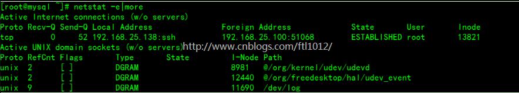

> 通常使用nestat命令分析linux服务器的网络状态，有助于我们了解服务器是否有隐患或者性能瓶颈。

# netstat 命令

> Netstat 命令用于显示各种网络相关信息，如网络连接，路由表，接口状态 (Interface Statistics)，masquerade 连接，多播成员 (Multicast Memberships) 等等。
>


## 参数

### 命令的格式和详细参数

netstat -h：

```
[vagrant@centos6 ~]$ netstat -h
usage: netstat [-vWeenNcCF] [<Af>] -r         netstat {-V|--version|-h|--help}
       netstat [-vWnNcaeol] [<Socket> ...]
       netstat { [-vWeenNac] -I[<Iface>] | [-veenNac] -i | [-cnNe] -M | -s [-6tuw] } [delay]

        -r, --route              display routing table #显示路由信息
        -I, --interfaces=<Iface> display interface table for <Iface>#显示监控中的服务器的Socket；
        -i, --interfaces         display interface table#显示网络界面信息表单；
        -g, --groups             display multicast group memberships#显示多重广播功能群组组员名单；
        -s, --statistics         display networking statistics (like SNMP)#显示网络工作信息统计表；
        -M, --masquerade         display masqueraded connections#显示伪装的网络连线；

        -v, --verbose            be verbose #显示指令执行过程；
        -W, --wide               don't truncate IP addresses#显示RAW传输协议的连线状况；
        -n, --numeric            don't resolve names#直接使用ip地址，而不通过域名服务器；
        --numeric-hosts          don't resolve host names
        --numeric-ports          don't resolve port names
        --numeric-users          don't resolve user names
        -N, --symbolic           resolve hardware names#显示网络硬件外围设备的符号连接名称；
        -e, --extend             display other/more information#显示网络其他相关信息；
        -p, --programs           display PID/Program name for sockets#：显示正在使用Socket的PID和程序名称；
        -o, --timers             display timers#显示计时器；
        -c, --continuous         continuous listing#持续列出网络状态；

        -l, --listening          display listening server sockets#显示监控中的服务器的Socket；
        -a, --all                display all sockets (default: connected)#显示所有连线中的Socket；
        -F, --fib                display Forwarding Information Base (default)#显示FIB；
        -C, --cache              display routing cache instead of FIB#显示路由器配置的快取信息；
        -Z, --context            display SELinux security context for sockets#

  <Socket>={-t|--tcp} {-u|--udp} {-U|--udplite} {-S|--sctp} {-w|--raw}
           {-x|--unix} --ax25 --ipx --netrom
  <AF>=Use '-6|-4' or '-A <af>' or '--<af>'; default: inet
  List of possible address families (which support routing):
    inet (DARPA Internet) inet6 (IPv6) ax25 (AMPR AX.25) 
    netrom (AMPR NET/ROM) ipx (Novell IPX) ddp (Appletalk DDP) 
    x25 (CCITT X.25) 
```


### 常用参数

```
-a(--all)：显示所有选项，netstat默认不显示LISTEN相关
-t(--tcp)：仅显示tcp相关选项
-u(--udp)：仅显示udp相关选项
-n(–-numeric)：直接使用IP地址，而不通过域名服务器。
-l(--listening)：仅列出有在 Listen (监听) 的服務状态
-p(--programs)：显示正在使用Socket的PID和程序名称
-r(--route): 显示路由信息，路由表
-e(--extend): 显示扩展信息，例如uid等
-s(--statistice): 显示网络工作信息统计表。 (重要)
-c(--route): 每隔一个固定时间，执行该netstat命令。
-h(--help): 在线帮助；
```


### 常用命令示例

#### 列出所有端口

```
netstat -a		#列出所有端口
netstat -at		#列出所有tcp端口
netstat -au		#列出所有udp端口
netstat -atp	#列出所有tcp端口，并显示PID
```

#### 列出所有处于监听状态的sockets

```
netstat -l		#列出所有监听转态的端口
netstat -lt		#列出所有监听状态的tcp端口
netstat -lu		#列出所有监听状态的udp端口
```

#### 显示协议的统计信息

```
netstat -s		#显示所有端口的统计信息
netstat -st		#显示tcp端口的统计信息
netstat -su		#显示udp端口的统计信息
```

eg：

```
[vagrant@centos6 ~]$ netstat -s | more
Ip:
    2081 total packets received
    2 with invalid addresses
    0 forwarded
    0 incoming packets discarded
    2079 incoming packets delivered
    1319 requests sent out
Icmp:
    0 ICMP messages received
    0 input ICMP message failed.
    ICMP input histogram:
    0 ICMP messages sent
    0 ICMP messages failed
    ICMP output histogram:
Tcp:
    0 active connections openings
    3 passive connection openings
```


#### 显示 PID 和进程名称

netstat -p 可以与其它开关一起使用，就可以添加 “PID/进程名称”

```
[root@centos6 ~]# netstat -pt
Active Internet connections (w/o servers)
Proto Recv-Q Send-Q Local Address               Foreign Address             State       PID/Program name
tcp        0      0 10.0.2.15:ssh               10.0.2.2:52964              ESTABLISHED 3008/sshd
tcp        0      0 10.0.2.15:ssh               10.0.2.2:52091              ESTABLISHED 2813/sshd
```


#### 显示关于以太网的统计数据

```
netstat –e
```

用于显示关于以太网的统计数据。它列出的项目包括传送的数据报的总字节数、错误数、删除数、数据报的数量和广播的数量。这些统计数据既有发送的数据报数量，也有接收的数据报数量。这个选项可以用来统计一些基本的网络流量）




## 输出信息

### man netstat

```
OUTPUT
   Active Internet connections (TCP, UDP, UDPLite, raw)
   Proto
       The protocol (tcp, udp, udpl, raw) used by the socket.

   Recv-Q
       Established: The count of bytes not copied by the user program connected to this socket.  Listening: Since Kernel 2.6.18 this column contains the current syn backlog.

   Send-Q
       Established: The count of bytes not acknowledged by the remote host.  Listening: Since Kernel 2.6.18 this column contains the maximum size of the syn backlog.

   Local Address
       Address and port number of the local end of the socket.  Unless the --numeric (-n) option is specified, the socket address is resolved to its canonical host name (FQDN), and the port number is translated into the corre‐
       sponding service name.

   Foreign Address
       Address and port number of the remote end of the socket.  Analogous to "Local Address."

   State
       The state of the socket. Since there are no states in raw mode and usually no states used in UDP and UDPLite, this column may be left blank. Normally this can be one of several values:
       ESTABLISHED
       SYN_SENT
       SYN_RECV
       FIN_WAIT1
       FIN_WAIT2
       TIME_WAIT
       CLOSE
       CLOSE_WAIT
       LAST_ACK
       LISTEN
       CLOSING
       UNKNOWN

   User
       The username or the user id (UID) of the owner of the socket.

   PID/Program name
       Slash-separated pair of the process id (PID) and process name of the process that owns the socket.  --program causes this column to be included.  You will also need superuser privileges to see this information on  sock‐
       ets you don't own.  This identification information is not yet available for IPX sockets.

   Timer
       (this needs to be written)

   Active UNIX domain Sockets
   Proto
       The protocol (usually unix) used by the socket.

   RefCnt
       The reference count (i.e. attached processes via this socket).

   Flags
       The  flags displayed is SO_ACCEPTON (displayed as ACC), SO_WAITDATA (W) or SO_NOSPACE (N).  SO_ACCECPTON is used on unconnected sockets if their corresponding processes are waiting for a connect request. The other flags
       are not of normal interest.

   Type
       There are several types of socket access:
       SOCK_DGRAM
              The socket is used in Datagram (connectionless) mode.
       SOCK_STREAM
              This is a stream (connection) socket.
       SOCK_RAW
              The socket is used as a raw socket.
       SOCK_RDM
              This one serves reliably-delivered messages.
       SOCK_SEQPACKET
              This is a sequential packet socket.
       SOCK_PACKET
              Raw interface access socket.
       UNKNOWN
              Who ever knows what the future will bring us - just fill in here :-)

   State
       This field will contain one of the following Keywords:
       FREE   The socket is not allocated
       LISTENING
              The socket is listening for a connection request.  Such sockets are only included in the output if you specify the --listening (-l) or --all (-a) option.
       CONNECTING
              The socket is about to establish a connection.
       CONNECTED
              The socket is connected.
       DISCONNECTING
              The socket is disconnecting.
       (empty)
              The socket is not connected to another one.
       UNKNOWN
              This state should never happen.

   PID/Program name
       Process ID (PID) and process name of the process that has the socket open.  More info available in Active Internet connections section written above.

```

### 基本信息

```
[vagrant@centos6 ~]$ netstat -tulnp
Active Internet connections (servers and established)
Proto Recv-Q Send-Q Local Address               Foreign Address             State       PID/Program name   
tcp        0      0 0.0.0.0:22                  0.0.0.0:*                   LISTEN      1904/sshd           
tcp        0      0 127.0.0.1:631               0.0.0.0:*                   LISTEN      1750/cupsd          
tcp        0      0 0.0.0.0:44567               0.0.0.0:*                   LISTEN      1713/rpc.statd      
tcp        0      0 0.0.0.0:10050               0.0.0.0:*                   LISTEN      1965/zabbix_agentd  
tcp        0      0 172.172.230.211:3306        0.0.0.0:*                   LISTEN      31849/mysqld        
tcp        0      0 0.0.0.0:111                 0.0.0.0:*                   LISTEN      1576/rpcbind        
tcp        0      0 :::22                       :::*                        LISTEN      1904/sshd           
tcp        0      0 ::1:631                     :::*                        LISTEN      1750/cupsd          
```

- **Proto**：protocol，协议名（tcp协议或udp协议）。

-  **Recv-Q**：网络接收队列。

  表示收到的数据已经在本地缓冲区，但是还有多少没有被进程取走。如果接收队列Recv-Q一直处于阻塞状态，可能是遭受了拒绝服务攻击。

- **Send-Q**：网络发送队列。

  对方没有收到的数据或者说没有ACK的，还是本地缓冲区。

  如果发送队列Send-Q不能很快的清零，可能是有应用向外发送数据包过快，或者对方接受数据包不够快。

  > Recv-Q和Send-Q这两个值通常应该为0，如果不为0可能是有问题的。packets在两个队列里都不应该有堆积状态。可接受短暂的非0情况。

- **Local Address**：本地地址

  - 0.0.0.0:22，表示监听服务器上所有ipv4地址的22端口。

    比如你的服务器是有172.172.230.210和172.172.230.11两个ip地址，那么0.0.0.0:22此时表示监听172.172.230.210,172.172.230.211,127.0.0.1三个地址的22端口

  - :::22，这个也表示监听本地所有ip的22端口，跟上面的区别是这里表示的是IPv6地址，上面的0.0.0.0表示的是本地所有IPv4地址。“:::” 这三个: 的前两个"::"，是"0:0:0:0:0:0:0:0"的缩写

  - 127.0.0.1:631 这个表示监听本机的loopback地址的631端口(如果某个服务只监听了回环地址，那么只能在本机进行访问，无法通过tcp/ip 协议进行远程访问)

  - ::1:631 这个表示监听IPv6的回环地址的631端口,::1这个表示IPv6的loopback地址

- **Foreign Address**：与本机端口通信的外部socket。显示规则和Local Address相同。

- **State**：TCP状态，共11种，详细看TCP状态转换。

  ESTABLISHED、SYN_SENT、SYN_RECV、 FIN_WAIT1、FIN_WAIT2、TIME_WAIT、 CLOSE、CLOSE_WAIT、 LAST_ACK、 LISTEN、CLOSING以及UNKNOWN。

- **PID/Program**：PID即进程id，Program即使用该socket的应用程序


# 常见使用场景

> 我们知道Linux操作系统对文件句柄的总量是有限制的，套接字也属于文件句柄，因此也是有限制的。了解套接字的状态有助于我们了解服务器是否有隐患或者性能瓶颈。
>
> 假设一台服务器最多有6万个句柄，如果由于某种业务场景，在服务器端出现大量的TIME_WAIT，此时这些套接字是无法马上释放，也就是无法马上被重复使用，但仍然占用6万句柄的名额。这块，随着时间的推移，可能会耗尽所有句柄，从而导致有新的连接请求是服务器端无法响应的问题。

## 统计端口、状态

1. 统计机器中网络连接各个状态个数:

	```
	netstat -an | awk '/^tcp/ {++S[$NF]}  END {for (a in S) print a,S[a]} '
	```
命令输出：
   ```
   LISTEN 37    
   CLOSE_WAIT 25    
   ESTABLISHED 581    
   FIN_WAIT2 9    
   TIME_WAIT 103
   ```


2. 把状态全都取出来后使用uniq -c统计后再进行排序

   ```
   netstat -ant|awk '{print $6}'|sort | uniq -c | sort -nr
   ```

   输出结果：

   ```
       575 ESTABLISHED
        82 TIME_WAIT
        37 LISTEN
        24 CLOSE_WAIT
        10 FIN_WAIT2
         1 Foreign
         1 established)
   ```

   

3. 查看连接某服务端口最多的的IP地址

   ```
   netstat -ant|grep "192.168.25.*"|awk '{print $5}'|awk -F: '{print $1}'|sort -nr|uniq –c
   ```


## 服务器存在大量TIME_WAIT

- 现象描述

  某对象存储服务，在监控系统发现有大量的TIME_WAIT。经确认该服务器是一台新上架接入的服务器。经反复确认，具备相同功能的同集群的其它服务器工作都正常，并不存在大量TIME_WAIT的情况。

- 问题分析

  结合协议我们知道主动关闭方会处于该状态，而且TIME_WAIT状态下的TCP连接会等待2*MSL。因此我们查看系统配置cat /proc/sys/net/ipv4/tcp_fin_timeout，发现是默认值。***因此，确定是等待时间太长，导致套接字无法被利用所致**。

- 解决问题

  通过调整内核参数解决，打开文件/etc/sysctl.conf，编辑文件，加入以下内容：

  ```
  net.ipv4.tcp_syncookies = 1
  net.ipv4.tcp_tw_reuse = 1
  net.ipv4.tcp_tw_recycle = 1
  net.ipv4.tcp_fin_timeout = 30
  ```

  然后执行/sbin/sysctl -p让参数生效。

  上述内容的含义具体如下：

  - net.ipv4.tcp_syncookies = 1

    表示开启SYN Cookies。当出现SYN等待队列溢出时，启用cookies来处理，可防范少量SYN攻击，默认为0，表示关闭；

  - net.ipv4.tcp_tw_reuse = 1

    表示开启重用。允许将TIME-WAIT sockets重新用于新的TCP连接，默认为0，表示关闭；

  - net.ipv4.tcp_tw_recycle = 1

    表示开启TCP连接中TIME-WAIT sockets的快速回收，默认为0，表示关闭。

  - net.ipv4.tcp_fin_timeout 

    修改系統默认的TIMEOUT时间。


##  服务器端大量ESTABLISHED

- 问题描述

  某Tomcat服务器出现大量ESTABLISHED连接。

- 问题分析

  根据协议状态转换情况，初步推断是tomcat服务器回收session时出了问题，这个一般都跟服务器的Timeout设置有联系。

- 解决方案

  修改服务的连接超时时间。


# 参考资料

> 感谢各位大佬的资料整理，小弟不才，按照自己的思绪再做整理。
>
> https://baijiahao.baidu.com/s?id=1626222867928553865&wfr=spider&for=pc
> [Linux命令大全](https://man.linuxde.net/netstat)
> https://www.cnblogs.com/ftl1012/p/netstat.html
> https://www.cnblogs.com/echo1937/p/6677325.html
>
> https://blog.csdn.net/m0_37556444/article/details/83000553
