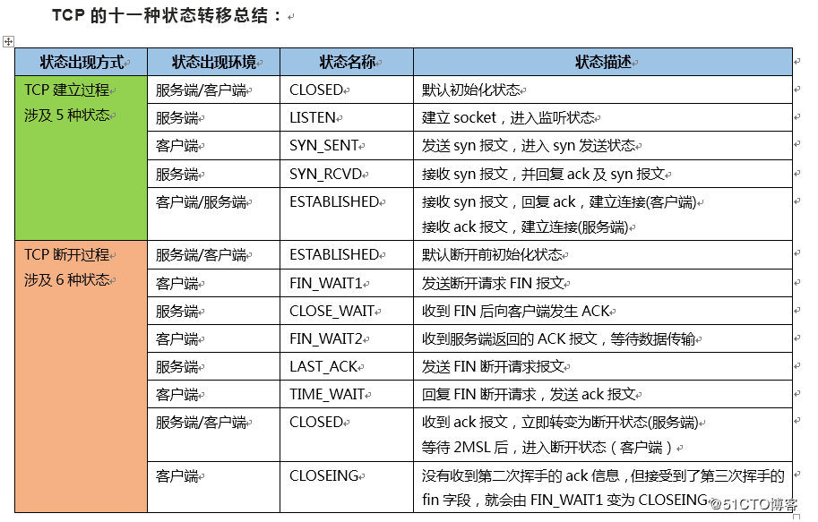

## TCP FLAGS 

> https://www.geeksforgeeks.org/tcp-flags/
> https://en.wikipedia.org/wiki/Transmission_Control_Protocol
> https://blog.csdn.net/gyunling/article/details/89330307

tcp 有9个标记位，长度都是1bit。

| 标记位  | 说明                                                         |
| ------- | ------------------------------------------------------------ |
| **SYN** | **Synchronization**，表示建立连接                            |
| **ACK** | **Acknowledgement**，表示确认对方的请求                      |
| **FIN** | **Finish**，表示请求断开连接                                 |
| **RST** | **Reset**，表示连接重置。用于重置由于主机崩溃或其他原因而出现错误的连接。或者发送包发送到一个不是期望的目的主机时，接收端发送reset 重置连接标志的包。 |
| **PSH** | **Push**，通知接收端处理接收的报文，而不是将报文缓存到buffer中 |
| **URG** | **Urgent**，通知接收端处理在处理其他包前优先处理接收到的紧急报文（urgent packets） |
| **NS**  | **nonce sum**，该标签用来保护不受发送者发送的突发的恶意隐藏报文的侵害。详见 RFC 3540。 |
| **CWR** | **Congestion window reduced**，发送者在接收到一个带有ECE flag包时，将会使用CWR flag。 详见RFC3168。 |
| **ECE** | **ECN-Echo**，ECN表示Explicit Congestion Notification。表示TCP peer有ECN能力。 |

