# TCP 三次握手分析

> 三次握手(Three-way Handshake)，是指建立一个 TCP 连接时需要客户端和服务器总共发送3个包。三次握手的目的是连接服务器指定端口，建立 TCP 连接，并同步连接双方的序列号和确认号，交换 TCP 窗口大小信息。

三次握手的基本流程如下：

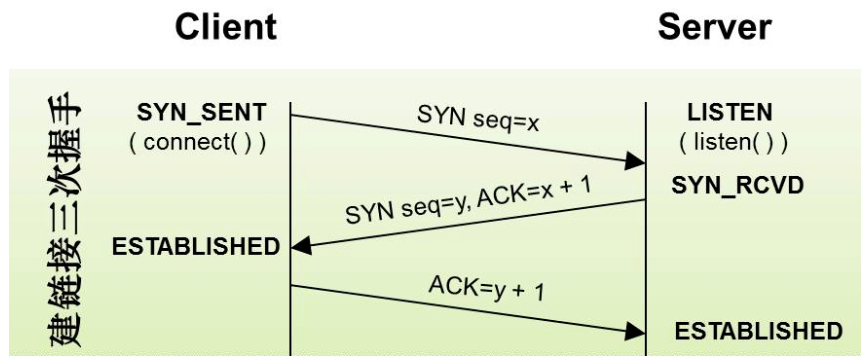

1. 第一次握手（SYN=1, seq=x）

   客户端发送一个 TCP 的 SYN 标志位置1的包，指明客户端打算连接的服务器的端口，以及初始序号 X,保存在包头的序列号(Sequence Number)字段里。

   发送完毕后，客户端进入 `SYN_SEND` 状态。

2. 第二次握手（SYN=1, ACK=1, seq=y, ACKnum=x+1）

   服务器发回确认包(ACK)应答。即 SYN 标志位和 ACK 标志位均为1。服务器端选择自己 ISN 序列号，放到 Seq 域里，同时将确认序号(Acknowledgement Number)设置为客户的 ISN 加1，即X+1。 

   发送完毕后，服务器端进入 `SYN_RCVD` 状态。

3. 第三次握手（ACK=1, ACKnum=y+1）

   客户端再次发送确认包(ACK)，SYN 标志位为0，ACK 标志位为1，并且把服务器发来 ACK 的序号字段+1，放在确定字段中发送给对方，并且在数据段放写ISN的+1。

   发送完毕后，客户端进入 `ESTABLISHED` 状态，当服务器端接收到这个包时，也进入 `ESTABLISHED` 状态，TCP 握手结束。

## wireshark抓包分析

1. 实验抓包地址：https://www.baidu.com/

2. wireshark过滤规则：http contains "baidu.com"，可以看到多条包数据。

   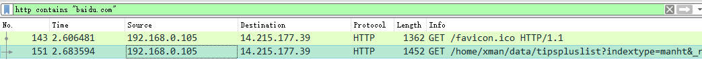

3. 选择其中一个HTTP请求，右击选追踪流 --> TCP流，就可以看到整一个

   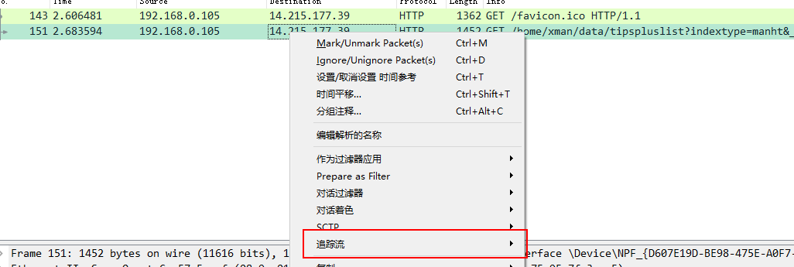

   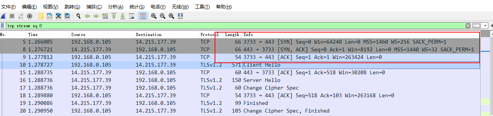

wireshark报文和TCP报文格式相对应：

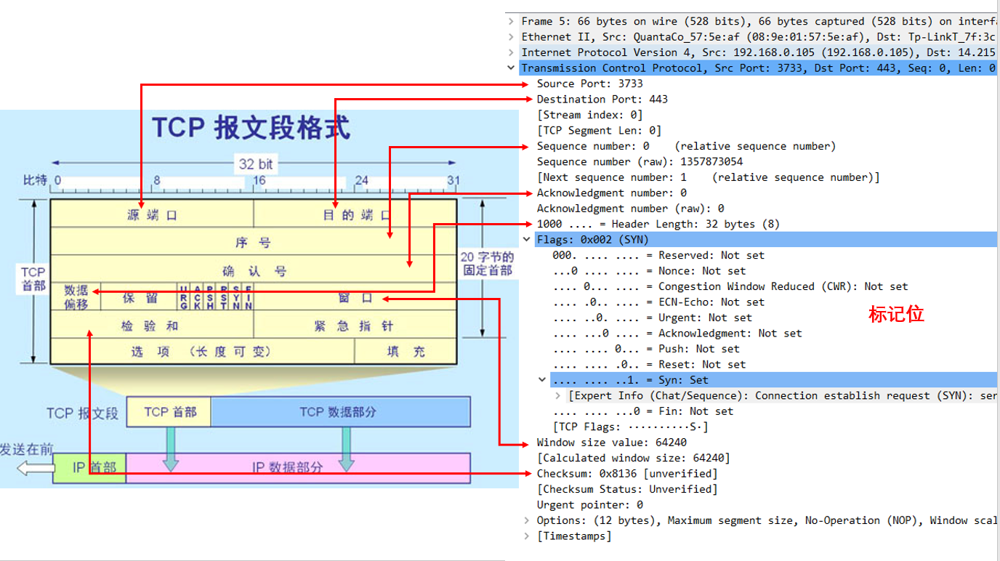

## 第一次握手

客户端向服务器发送连接请求包，标志位SYN（同步序号）为1，序号Seq=0（记为x）。

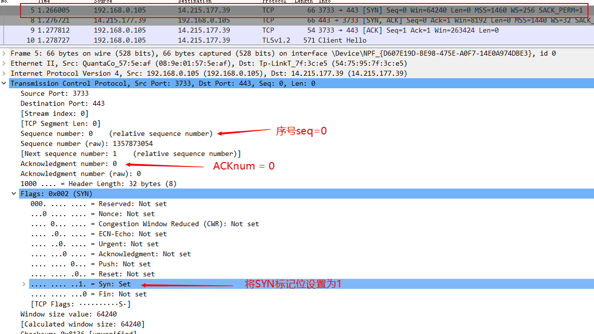

## 第二次握手

服务器收到客户端的报文，由SYN=1知道客户端要求建立连接。服务端向客户端发送一个SYN=1和ACK=1的TCP报文，设置序号=0（记为y），将确认序号（Acknowledgement Number）设置为客户端的序号+1，即x+1。

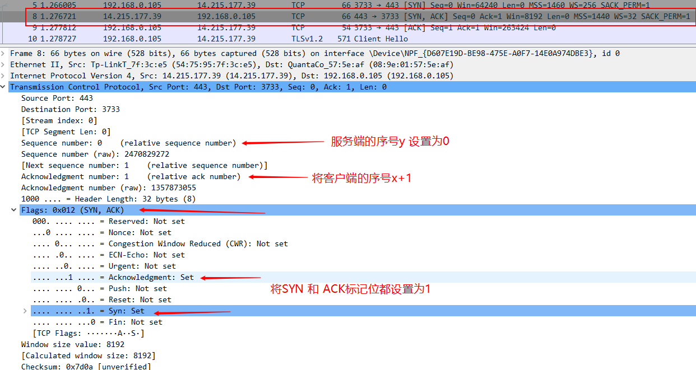

## 第三次握手

客户端收到服务器发来的包（SYN+ACK）后，需要做以下确认：

- 确认序列号（Acknowledgement Number）是否正确，即客户端第一次发送的序号加1（即x+1）。
- 确认标记位ACK是否为1。

如果正确，客户端会再次发送确认包，ACK=1, SYN=0, Acknowledgement Number=1(y+1=0+1=1)，seq=1（x+1）。

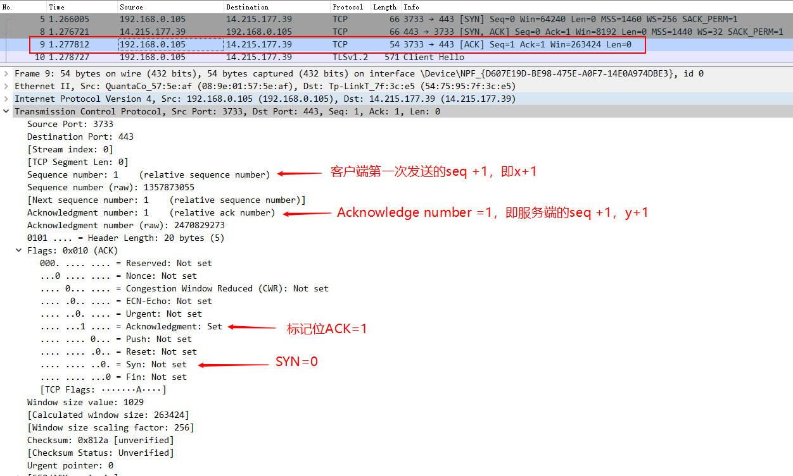

就这样通过了TCP三次握手，建立了连接。完整流程串起来就是：

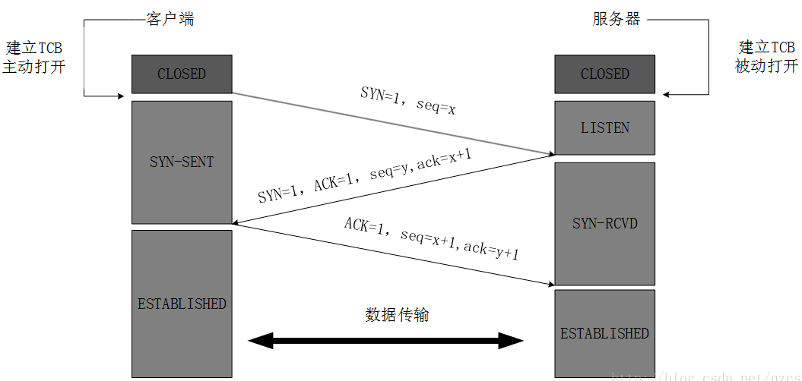

# TCP 四次挥手分析

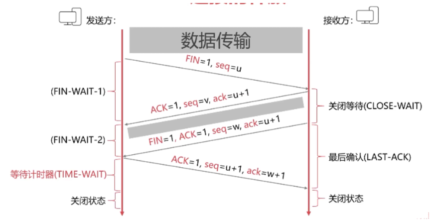

## 第一次挥手（FIN=1,seq=x）

客户端想要关闭连接，向服务器发送一个FIN=1的包，表示自己已经没有数据可以发送了。

发送完毕，客户端进入`FIN_WAIT_1` 状态。

## 第二次挥手（ACK=1, ACKnum=x+1）

服务器确认客户端的FIN包，发送一个确认包，表明自己接收到客户端的关闭连接的请求，但是还没准备好关闭连接。

发送完毕，服务器进入`CLOSE_WAIT` 状态，客户端接收到这个确认包后，进入`FIN_WAIT_2` 状态，等待服务器端关闭连接。

## 第三次挥手（FIN=1,seq=y）

服务器准备好关闭连接时，向客户端发送结束连接的请求，FIN=1.

发送完毕后，服务器进入`LAST_ACK` 状态，等待来自客户端的最后一个ACK。

## 第四次挥手（ACK=1,ACKnum=y+1）

客户端接收到来自服务器的关闭请求，发送一个确认包，并进入`TIME_WAIT`状态，等待可能出现的要求重传的 ACK 包。

服务器端接收到这个确认包之后，关闭连接，进入 `CLOSED` 状态。

客户端等待了某个固定时间（两个最大段生命周期，2MSL，2 Maximum Segment Lifetime）之后，没有收到服务器端的 ACK ，认为服务器端已经正常关闭连接，于是自己也关闭连接，进入 `CLOSED` 状态。

# 总结

一个http请求的完整周期是：

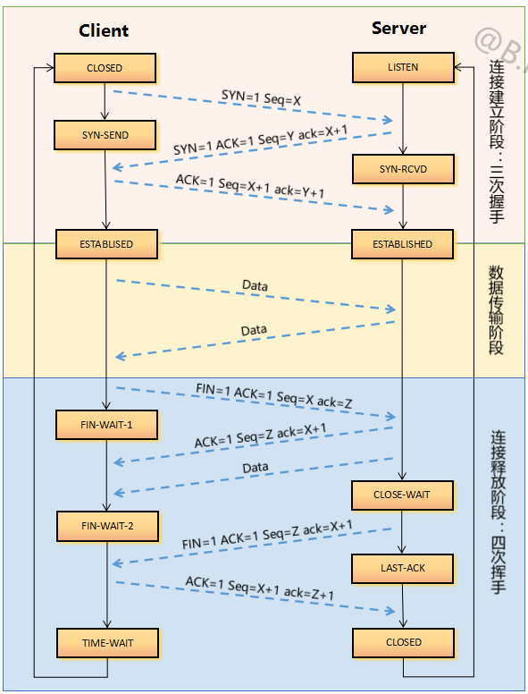

整个过程，客户端所经历的状态如下：

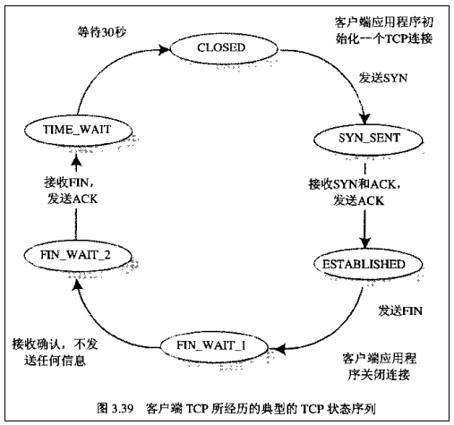

而服务端所经历的过程如下：

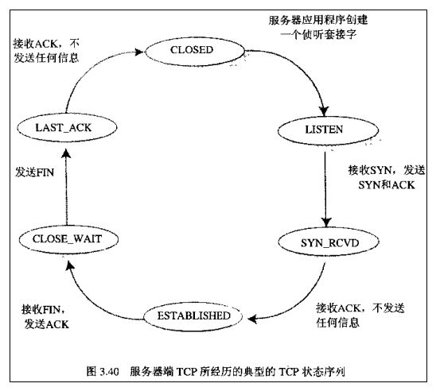

# 参考资料

> https://blog.csdn.net/whuslei/article/details/6667471
>
> https://hit-alibaba.github.io/interview/basic/network/TCP.html
>
> https://www.cnblogs.com/bylijian/p/8565601.html